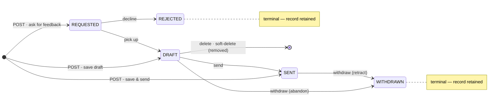

### Feedback lifecycle (statuses & transitions)

A feedback moves through a small state machine. The authoritative rules live in `feedbacks/FeedbackService.kt` — `isAllowedTransition` (the edges) and `validate` (the invariants); read/write authorization is in `authz/Guards.kt`. `FeedbackStatus` (`feedbacks/Feedback.kt`) has five values:

- **`REQUESTED`** — feedback has been requested of a provider (e.g. via "Ask for feedback"); awaits the provider picking it up or declining. **Requires a non-null requester.**
- **`DRAFT`** — the provider's private work in progress; **hidden from the subject** until it leaves `DRAFT`.
- **`SENT`** — delivered; visible to the subject / requester per `FeedbackVisibility`.
- **`WITHDRAWN`** — terminal; the provider retracted the feedback.
- **`REJECTED`** — terminal; the provider declined a request.

Create (`POST`) permits any status (no transition gate); the realistic entry points are
`REQUESTED`/`DRAFT`/`SENT`. `WITHDRAWN`/`REJECTED` are terminal records that are **retained**;
the `DRAFT → [*]` edge is the provider-only **soft-delete** (the row is flagged and drops out of
reads/lists, distinct from the retained terminal states). Details below.

**Allowed transitions** (anything not listed → `409` via `ConflictException` from `FeedbackService.transition`, mapped by `StatusPages`; `WITHDRAWN` and `REJECTED` are terminal with no outgoing edges):

| From → To | Who | Meaning |
|---|---|---|
| `REQUESTED → DRAFT` | provider | provider picks up the request |
| `REQUESTED → REJECTED` | provider | provider declines the request (terminal) |
| `DRAFT → SENT` | provider | deliver the feedback |
| `DRAFT → WITHDRAWN` | provider | abandon a draft (terminal) |
| `SENT → WITHDRAWN` | provider | retract a sent feedback (terminal) |

Every transition is performed via a dedicated **POST action endpoint** — `POST /api/v1/feedbacks/{id}/send` / `/withdraw` / `/reject` / `/pick-up` (no body; shared `transitionTo` handler in `feedbacks/FeedbackRoutes.kt`) — and is gated by `canWriteFeedback` (provider only — ADMIN does not get feedback write access), so only the provider can send, withdraw, pick up, or reject.

**Delete (separate from the transitions).** `DELETE /api/v1/feedbacks/{id}` **soft-deletes** a feedback (it disappears from reads/lists; the row and its audit trail are retained). It is **provider-only** (`canWriteFeedback`) and **DRAFT-only** — deleting a non-`DRAFT` feedback is `400` (other statuses use the terminal `WITHDRAWN`/`REJECTED` transitions instead). On delete the route records a deletion **audit event** (`feedbackDeletionEvent`) and, if the feedback has a requester, sends them a **notification with no link** that the provider deleted it (`feedbackDeletionNotifications`). Distinct from `DRAFT → WITHDRAWN`, which keeps the feedback visible as a terminal record.

**Creation vs. update.** On **create** (`POST`) any status is permitted — there is no transition gate, so the UI can create a feedback directly as `SENT` ("save & send") or as `REQUESTED` ("ask for feedback"). The transition check above applies only on **update**. The following invariants are enforced on **both** create and update: provider == subject is allowed (a **self-reflection**, see below — standalone or requested); requester ≠ provider; `REQUESTED` requires a requester; **a feedback with a requester may not use `PROVIDER_SUBJECT` visibility** (that visibility excludes the requester, so the combination is contradictory); and the mirror image, **`PROVIDER_REQUESTER` visibility requires a requester** (without one that visibility excludes everyone but the provider — and the subject's Received list would leak its preview).

**No-duplicate invariant.** Creation (any target status) is **409** while an active feedback in `DRAFT` or `REQUESTED` status exists with the same **(subjectId, providerId, requesterId)** triple — a null requester matches only null (`FeedbackService.findOpenDuplicate`, checked inside `create()`'s transaction; no DB unique index by design). The `ProblemDetail.instance` carries `/api/v1/feedbacks/{id}` of the existing record (`ConflictException(message, instance)` → `respondProblem`'s `instance` param). Pick-up (`REQUESTED → DRAFT`) is guarded the same way against a matching DRAFT (reachable only with pre-invariant duplicates). The SPA warns **before** the user fills anything: `GET /api/v1/feedbacks/duplicate-check?subjectId&providerId[&requesterId]` (party-scoped like creation — a matching row always has the caller as a party, so no unrelated draft's existence can be probed) → `{existingId, existingStatus}`; the four create screens (`CreateFeedback`/`SelfReflection` via `FeedbackForm`'s `duplicate` prop, `AskFeedback`, `RequestFeedback` per selected provider) render `components/DuplicateFeedbackAlert.tsx` with an edit link (provider) or view link (requester) and disable submission (`hooks/useFeedbackDuplicate.ts`). Covered by `FeedbackDuplicateTest` (server) and the create pages' SPA tests.

**Self-reflection (provider == subject).** A user may write feedback **about themselves**: same entity/lifecycle, `providerId == subjectId`. Two flavors: **standalone** (no requester — the SPA's Self-reflection screen; enters as `DRAFT`/`SENT`) and **requested** (a requester — never the subject themselves, since requester ≠ provider — asks the subject for a self-reflection via "Request feedback", whose provider picker deliberately offers the subject; enters as `REQUESTED` and triages/flows like any request). No other backend special-casing: the provider rules give the author full read/write at any status, and a manager in the author's chain reads it once delivered, exactly like any other feedback. Notifications for self rows: everything aimed at the subject/provider (the acting user) is dropped (`feedbackTransitionNotifications` filters recipients == provider when subject == provider); **requester- and manager-directed notifications survive** (neither recipient is the actor), worded via the `self` i18next context (`params.self` — `"self"` on the provider/transition/deletion/manager notes, `"reflection"` on the requester's request confirmation; keys `notifications.event.*_self`/`*_reflection`). A standalone self row therefore notifies only the author's direct managers once delivered (nothing at all when they have none). SPA entry point: the left-menu "Self-reflection" button (above "Change password") → `/feedback/self` (`web/src/pages/SelfReflection.tsx`, modeled on `CreateFeedback.tsx`): both parties are the caller ("You"), visibility offers only Provider+subject (default) / Public (the standard no-requester pair), and save/cancel land on `/feedback?tab=provided`. Tests: `SelfReflectionTest` (server), `SelfReflection.test.tsx` + `RequestFeedback.test.tsx` (SPA). Transition and invariant behavior is covered by `FeedbackRoutesTest` (transitions + the invariant) and `AuthorizationTest` (the `FeedbackVisibility` read matrix).

**Requester message.** A feedback carries an optional `requesterMessage` (`feedbacks.requester_message`, `V20`) — the requester's clarification note to the provider, captured by the "Ask for feedback" / "Request feedback" forms (`AskFeedback.tsx` / `RequestFeedback.tsx`). It is **set once at creation and never updated**: `FeedbackService.update` simply omits the column, so `PUT` cannot change it (no validation error — the field is ignored). The SPA displays it read-only via `web/src/components/RequesterMessage.tsx` (renders nothing when null/empty) on the view screen, the `REQUESTED` triage screen, and the `DRAFT` editor.

**Frontend: the `REQUESTED` decision screen.** Because `REQUESTED → SENT` is not a valid edge, the editor must not offer "Save & send" for a pending request. So `web/src/pages/EditFeedback.tsx`, when the loaded feedback is `REQUESTED` and the caller is its provider, renders a read-only **triage screen** (subject + requester names, no editor) instead of the `FeedbackForm` editor, with exactly three actions:

- **Close** — navigate back, change nothing.
- **Reject** — confirmation modal → `REQUESTED → REJECTED`, returns to the originating tab.
- **Accept** — `REQUESTED → DRAFT`, then **reloads in place** (invalidates the `["feedback", id]` query rather than navigating) so the same route re-renders as the normal `DRAFT` editor (Cancel / Save draft / Save & send). `handleSave` distinguishes this case via `accepted = data.status === "REQUESTED" && status === "DRAFT"` and skips the post-save navigate.

**Frontend: the DRAFT editor's Delete action.** The `DRAFT` editor (`FeedbackForm` via `EditFeedback.tsx`) shows a fourth action — a red **Delete** — alongside Cancel / Save draft / Save & send, but only when the caller is the draft's provider (`data.status === "DRAFT" && getUserId() === data.providerId`). It opens a confirmation `Modal` (mirroring the Reject modal) whose confirm calls `deleteFeedback(id)` → on success invalidates `["feedbacks"]`/`["feedback", id]` and navigates to the originating tab. `FeedbackForm` takes optional `onDelete`/`deleting` props and renders the button only when `onDelete` is set.

`FeedbackForm` is therefore only ever the editor for `DRAFT` and the create flows; it carries no reject affordance. This mirrors the backend state machine in the UI (defense-in-depth, not a relaxation of the server check). Covered by `web/src/pages/EditFeedback.test.tsx`.

**Frontend: the simplified requester view.** On the read-only view (`web/src/pages/ViewFeedback.tsx`), when the caller is the **requester** and the feedback is unfinished (`REQUESTED`, `DRAFT`) or declined (`REJECTED`), the **Content** section is hidden — mirroring the server's `canReadFeedbackContent` redaction. The gate is `isRequester && (status === "REQUESTED" || status === "REJECTED" || status === "DRAFT")` (`isRequester = data.requesterId != null && getUserId() === data.requesterId`); every other viewer and status still renders Content. Covered by `web/src/pages/ViewFeedback.test.tsx`.

### Feedback list views (`GET /api/v1/feedbacks?view=…`)

`FeedbackService.list` (`feedbacks/FeedbackService.kt`) scopes rows by `view` + the caller; the shared paging/filter helpers then apply on top. The caller-relative view scopes (the HR auditor `view=user` is documented in `.claude/docs/authorization.md`):

- **`received`** (the subject's inbox): `subjectId == caller`, scoped **exactly like `canReadFeedback`** so every listed row is also openable — *caller is the requester* and visibility ∈ {`PROVIDER_REQUESTER`,`PROVIDER_REQUESTER_SUBJECT`} (any status); OR *plain subject* (no requester, or someone else's) and visibility ∈ {`PROVIDER_SUBJECT`,`PROVIDER_REQUESTER_SUBJECT`} and status ∈ {`SENT`,`WITHDRAWN`}; OR `PUBLIC` + `SENT` (either role).
- **`provided`**: `providerId == caller` (every status/visibility).
- **`kudos`** (the org-wide Kudos wall, v2.2.0): **every** row with `visibility = PUBLIC` and `status = SENT`, no caller anchor — exactly the rows `canReadFeedback`'s PUBLIC+SENT branch already grants **any** authenticated caller, so the scope adds no new read surface. Kudos rows additionally carry the **full decrypted `content`** next to the usual 200-char `contentPreview` (`FeedbackListItem.content`, `@EncodeDefault(NEVER)` — the key is OMITTED on every other view; the users-list `teams` idiom) so the wall expands cards inline without a per-card GET. Intended ordering is `sort=-lastModified` (for a SENT row that IS the send moment unless it was edited afterwards via the API — the SPA never edits SENT rows). **SPA**: left-menu **"Kudos"** → `/kudos` (`pages/Kudos.tsx`, gated `FEEDBACKS` in nav + page + the `nav-kudos` tour step) — a newest-first Mantine `Timeline`, each card provider → subject + relative time + the content **always rendered as markdown** inside the shared `ProseBox` frame, clamped to 3 lines (v2.6.3; markdown-in-ProseBox rendering since v2.5.1); a "Show more"/"Show less" toggle renders ONLY when the clamp actually hides something (measured `scrollHeight` overflow) — short cards are non-interactive. No filters, no pagination bar: **the repo's first infinite scroll** (`useInfiniteQuery` + a `useIntersection` sentinel; happy-dom tests stub `IntersectionObserver` — see `Kudos.test.tsx`). Tests: the three kudos cases in `FeedbackRoutesTest`, `Kudos.test.tsx`, `e2e/tests/kudos.spec.ts`.
- **`team`** (manager oversight): subject is one of the caller's **direct reports** by default, or — with the strict-boolean `includeIndirect=true` param (`view=team` only, else `400`) — anyone in the caller's **transitive management chain** (`directSubordinateIds`/`transitiveSubordinateIds` in `teams/ManagementChain.kt` — members of non-soft-deleted teams the caller manages, plus recursively the members of teams those members manage; cycle-safe, never the caller themselves), AND (`providerId == caller` OR `requesterId == caller` OR status ∈ {`SENT`,`WITHDRAWN`}) — i.e. a party to it at any status, otherwise only once delivered. The direct-only default is a list scope, not an authorization boundary — the single-GET stays transitive.

Content **previews** are blanked when the feedback is unfinished (`DRAFT`/`REQUESTED`) and the caller is its requester (mirrors `canReadFeedbackContent`). The `/users/:id/feedbacks` page (`ManagerFeedbacks.tsx`) composes two of these as tabs (`?tab=received|provided`, default `received`): received = `received&providerId=:id` ("from them to you"), provided = `provided&subjectId=:id` ("from you to them"); its "Back to …" link is origin-aware via `?from=` (+ `?teamId=` for the team-members origin). These list scopes and `canReadFeedback` (the single-GET gate) are maintained separately but are now **fully aligned** — a listed row is always openable: the `received` scope mirrors the read matrix exactly (above), and the manager rule matches in both (delivered-only — `SENT`/`WITHDRAWN` — unless the manager is themselves a party). When changing either, keep the other in sync (`FeedbackRoutesTest` pins the alignment).

### Feedback events (audit history)

`feedback_events` (`feedbacks/FeedbackEvent.kt` + `FeedbackEventService.kt`, table `V15`) is an **immutable audit trail** of feedback changes: `feedbackId`, `userId` (the acting caller), server-set `timestamp` (epoch millis), and a **structured event** — `event_type` (`FeedbackEventType`: `CREATED`/`DELETED`/`STATUS_CHANGED`/`CONTENT_UPDATED`/`CONTENT_AND_VISIBILITY_UPDATED`/`VISIBILITY_CHANGED`) + a `params` JSON map of enum names (e.g. `{from,to}`; `{}` when none). No rendered string is stored — the SPA localizes it. Rows are minted as a side-effect — there is **no create/update/delete API**. The events come from side-effect-free helpers in `feedbacks/FeedbackEvents.kt` (`feedbackCreationEvent` / `feedbackUpdateEvent` / `feedbackDeletionEvent` returning a `FeedbackEventDescriptor`, unit-tested in `FeedbackEventsTest`). `feedbacks/FeedbackRoutes.kt` persists them (via `descriptor.toEvent(feedbackId, userId)`): one event on `POST` (create), one on `PUT` when the content/visibility actually changed, and one from each `POST …/{id}/send|withdraw|reject|pick-up` action (status transition). Read via **`GET /api/v1/feedbacks/{id}/events`** → `FeedbackEventList` (`{ items: [...] }`, oldest first, with resolved `userName`, `type`, `params`); authorized exactly like the single-GET (`requireFeedbackReadAllowingManager`). The SPA shows it as a `Timeline` ("History") on `web/src/pages/ViewFeedback.tsx` via `web/src/components/FeedbackHistory.tsx`, whose `describeEvent` **renders each event in the viewer's language** from `feedback.event.*` keys, interpolating the shared `common.status.*`/`common.visibility.*` labels.

**Feedback bottom-section tabs.** Both the view (`web/src/pages/ViewFeedback.tsx`) and edit (`web/src/components/FeedbackForm.tsx`, when `feedbackId` is set) screens render a three-tab bottom section: **Content**, **History** (the audit `Timeline` above), and **Lifecycle**. The Lifecycle tab renders `web/src/components/FeedbackLifecycle.tsx` — a hand-authored inline-SVG, theme-aware (Mantine CSS vars), end-user-facing state diagram (Requested → Draft → Sent, with terminal Rejected/Withdrawn; the delete path is omitted as it's not a viewable state). It takes an optional `currentStatus` (the live `data.status`, threaded through `FeedbackForm` on edit) to highlight the current node. Labels reuse `common.status.*`; tab/caption strings are `feedback.lifecycle*`.

