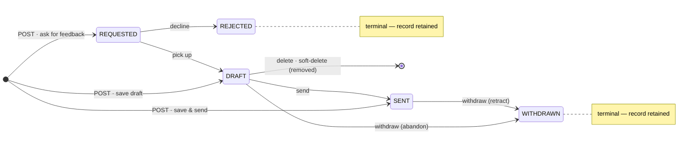

# CLAUDE.md

This file provides guidance to Claude Code (claude.ai/code) when working with code in this repository.

## Commands

Gradle wrapper is at `./gradlew` (use `gradlew.bat` on Windows). JDK 21 toolchain is required (auto-provisioned via foojay-resolver).

- Build everything: `./gradlew build`
- Run the server (Ktor + Netty on port 8080): `./gradlew :server:run`
- Run all tests: `./gradlew test`
- Run server tests only: `./gradlew :server:test`
- Run a single test: `./gradlew :server:test --tests "ch.nokillswit.ServerTest.security headers are set on responses"`
- Package the server for deployment: `./gradlew :server:installDist` (output under `server/build/install/server/`, launcher `bin/server`). **Do not use `:server:buildFatJar`** — the shadow plugin collapses the duplicate `META-INF/services/org.flywaydb.core.extensibility.Plugin` descriptors and the fat JAR NPEs at startup inside Flyway's plugin registry. `installDist` keeps each dependency JAR separate, so Flyway's `ServiceLoader` discovery works exactly as under `:server:run`.
- **JVM footprint tuning** is baked into the `application {}` block in `server/build.gradle.kts` via `applicationDefaultJvmArgs` = `-XX:+UseSerialGC -Xmx256m -XX:TieredStopAtLevel=1`, so it flows into both `bin/server` (→ Docker image) and `:server:run` (the Gradle `test` task is unaffected). Measured on a 512 MiB Linux container: baseline G1 drifts **~345→410 MiB RSS** as it grows its heap, vs a steady, deterministic **~270 MiB** with these flags (**~25% lower and predictable**); startup is ~1.6 s either way, so the win is memory, not startup. SerialGC removes G1's per-heap overhead (~75 MiB); `-Xmx256m` caps a heap that holds no large caches (drop to `192m` to trim ~25 MiB more); C1-only (`TieredStopAtLevel=1`) trims code-cache + C2-compiler memory (~50 MiB) at the cost of peak CPU-bound throughput (irrelevant here — **remove that flag if the service ever runs hot**). Override per-deploy with `JAVA_OPTS`/`SERVER_OPTS` (the launcher appends both). Container ceilings match: `mem_limit: 512m` in `docker-compose.yaml`, `resources.limits.memory: 512Mi` (request `320Mi`) in `k8s/app-deployment.yaml`. This was evaluated instead of a GraalVM native-image migration, which the reflection/ServiceLoader-heavy stack (Ktor config modules, Flyway, Exposed, OTel, Logback, java-jwt) makes costly for little benefit on a long-running internal service.
- **Run the whole stack with one command: `docker compose up --build`** (only Docker required). See "Running the full stack" below.

## Running the full stack

Two ways to run, sharing the same `docker-compose.yaml`:

- **One command (clone & run / demo):** `docker compose up --build` builds the SPA, builds the server, starts PostgreSQL, runs Flyway on boot, and serves everything at `http://localhost:8080` (Swagger at `/openapi`). Tear down with `docker compose down` (add `-v` to drop the DB volume).
- **Local development (hot reload, unchanged):** `docker compose up postgres` + `./gradlew :server:run` + `cd web && npm run dev` (Vite on `:5173`, proxying `/api` → `:8080`).
- **Local Kubernetes (OrbStack):** `docker build -t lettuce-app:latest .` then `kubectl apply -f k8s/`. The `k8s/` manifests are kompose-derived from `docker-compose.yaml` with three fixes baked in: the app image is the locally built `lettuce-app:latest` with `imagePullPolicy: IfNotPresent` (OrbStack's cluster shares the Docker image store — no push needed), the postgres healthcheck is a proper argv-list exec probe (kompose emits it as one unrunnable string) doubling as the readiness gate, and the app service is `type: LoadBalancer` (or `kubectl port-forward svc/app 8081:8080`). After rebuilding the image, `kubectl rollout restart deployment/app` picks it up. **Teardown:** `kubectl delete -f k8s/` removes everything *including the DB volume* (the `local-path` storageclass reclaim policy is Delete); to stop the workloads but keep the data, `kubectl scale deployment app postgres --replicas=0` instead. **Database only:** apply just the three `postgres-*` manifests — but the Service is ClusterIP, so host access needs `kubectl port-forward svc/postgres 5432:5432`; for local dev `docker compose up postgres` remains the preferred path (never run both against host `:5432` — they are separate databases with separate volumes). **Secrets:** both deployments consume the `lettuce-secrets` Secret via `secretKeyRef` (`JWT_SECRET`, `POSTGRES_USER`/`POSTGRES_PASSWORD`, `ADMIN_INITIAL_PASSWORD`); `k8s/secret.yaml` is a placeholder **template** — create the real Secret out-of-band (`kubectl create secret generic lettuce-secrets --from-literal=…`, command in the file) since applying the template verbatim fail-closes at startup (the placeholder JWT value is on the burned list). The app deployment runs production mode (`KTOR_DEVELOPMENT=false`, `HTTP_BEHIND_PROXY=true` — it expects a TLS-terminating ingress that sets `X-Forwarded-For`/`-Proto`); for throwaway plain-HTTP local-cluster testing, flip `KTOR_DEVELOPMENT` to `"true"` in `k8s/app-deployment.yaml`.

The root `Dockerfile` is a 3-stage build: (1) `node` builds `web/dist`, (2) `eclipse-temurin:21-jdk` runs `:server:installDist`, (3) `eclipse-temurin:21-jre` runtime bundles the install image **and** the built SPA, sets `WEB_STATIC_DIR=/app/web`, and runs `bin/server`. The `app` Compose service points the `POSTGRES_*` env vars at the `postgres` service host and waits on its healthcheck. `.dockerignore` keeps build outputs / `node_modules` out of the build context; `.git` is **included** on purpose — the SPA build stage reads the commit sha/timestamp from it for the version stamp (see "Build version stamp" under "Frontend").

## Architecture

Multi-module Gradle build (Kotlin DSL) defined in `settings.gradle.kts` with three Kotlin modules plus a separate JS frontend in `web/`:

- **`core`** — Kotlin Multiplatform (JVM target only currently). Shared code consumed by `server`. Holds the OpenTelemetry SDK bootstrap (`getOpenTelemetry(serviceName)`).
- **`server`** — Kotlin/JVM. The Ktor application. Depends on `core`.
- **`web/`** — Vite + React + TypeScript SPA that consumes the server's HTTP API. Standalone npm workspace; Gradle does not touch it.

Group is `ch.nokillswit`, version `1.0.0-SNAPSHOT` (set in root `build.gradle.kts`). Dependency versions are centralized in `gradle/libs.versions.toml`; Ktor itself comes from a separate version catalog (`ktorLibs`) loaded from `io.ktor:ktor-version-catalog` in `settings.gradle.kts`.

### Server bootstrap model

`server/src/main/kotlin/main.kt` just delegates to `io.ktor.server.netty.EngineMain`. The application is wired declaratively in `server/src/main/resources/application.yaml` under `ktor.application.modules` — each entry is a fully-qualified extension function on `Application` (e.g. `ch.nokillswit.plugins.HttpKt.configureHttp`). To add a new cross-cutting concern, create a new `configureXxx()` extension under `plugins/` and register it in `application.yaml`; do not call it from `main.kt`.

### Package layout

```
ch.nokillswit
├── main.kt
├── plugins/            cross-cutting Ktor wiring (configureXxx that only `install` plugins)
├── infra/db/           Flyway migrations + R2DBC connection bootstrap
├── infra/paging/       list-endpoint paging/sort/filter helper (parsePaging, applyPaging)
├── audit/              security audit trail: `audit(event, fields…)` → AUDIT-marked structured logs (see "Audit trail")
├── authz/              RBAC guards + CallerPrincipal (see "Authorization model")
├── auth/               POST /api/v1/login, /api/v1/refresh, /api/v1/logout + token minting + password hashing + LoginThrottle
├── users/              /api/v1/users/* CRUD + list + UserService + Users table
├── teams/              /api/v1/teams/* CRUD + list + member sub-resource + TeamService + Teams/TeamMembers tables
├── templates/          /api/v1/templates/* CRUD + list + TemplateService + Templates table (read: any authenticated; write: ADMIN)
├── feedbacks/          /api/v1/feedbacks/* CRUD + list + FeedbackService + Feedbacks table + FeedbackVisibility
└── notifications/      /api/v1/notifications/* list + read + seen/unseen + delete + NotificationService + Notifications table (recipient-scoped)
```

Routing is feature-local: each feature package registers its own routes from its `configureXxx` module. `plugins/Routing.kt` owns only the SPA: when `WEB_STATIC_DIR` (config key `web.staticDir`) is set, `configureRouting` installs `singlePageApplication` to serve `web/dist` with an `index.html` fallback; when unset (local dev / tests, where Vite serves the SPA), it installs no routes at all (there is no `GET /` placeholder). The scaffolding demo endpoints (`/ws`, `/json/kotlinx-serialization`, `/session/increment`, the "Hello, World!" root) and their plugins (`Sessions`, `Websockets`, the `GreetingService` DI sample, the inert `RequestValidation` rule) have been removed.

Module load order in `application.yaml` matters for inter-module attribute reads: `configureSecurity` puts `JwtConfigKey` in `attributes`; `configureDatabase` puts `UserServiceKey`; `configureBootstrap` reads `UserServiceKey` (so it runs right after Database); `configureAuthRoutes` and `configureUserRoutes` read both keys, so they must run after both. Current order: plugins → `infra/db` (Flyway → Database → Bootstrap) → features (users, auth) → catch-all `configureRouting`.

### Persistence

PostgreSQL is the only database. Connection settings come from the `postgres:` block in `application.yaml` (env-overridable via `POSTGRES_JDBC_URL`, `POSTGRES_R2DBC_URL`, `POSTGRES_USER`, `POSTGRES_PASSWORD`); defaults match the `docker compose up postgres` service. There is one persistence stack:

- **Flyway** (`infra/db/Flyway.kt`) — runs schema migrations from `server/src/main/resources/db/migration/` at startup via the Java API, opening a short-lived JDBC connection. Migrations are the single source of truth for schema; do not call `SchemaUtils.create` anywhere.
- **Exposed + R2DBC** (`infra/db/Database.kt` + `users/UserService.kt`) — runtime DB access. `Database.kt` connects the `R2dbcDatabase` and publishes `UserServiceKey`; the service itself lives next to the feature it serves. The Exposed table objects (e.g. `UserService.Users`) are used for queries only, not DDL.

The `org.postgresql:postgresql` JDBC driver is on the classpath solely for Flyway; runtime queries go through R2DBC.

Current migrations are `V1`–`V21`: schema for users/teams/feedbacks/revoked-tokens; the `users.role` column (`V5`); the `admin@lettuce.local` seed (`V6`); soft-delete `marked_as_deleted` columns (with index) on `users` (`V7`), `teams` (`V8`), `templates` (`V16`), `notifications` (`V17`), and `feedbacks` (`V19`); a demo-org seed (`V9`); a feedback templates table (`V10`); the `REJECTED` feedback status (`V11`); a feedback `last_modified` column (`V12`); the `notifications` table (`V13`); a seed of four default feedback templates (`V14`, idempotent via `ON CONFLICT (name)`); the `feedback_events` audit table (`V15`, `ON DELETE CASCADE` from `feedbacks`); partial unique indexes that free `templates.name` (`V16`) and `users.email` (`V18`) on soft-delete (see "Soft delete" below); the nullable `feedbacks.requester_message` column (`V20`, see "Requester message" under "Feedback lifecycle"); and `users.password_changed_at` (`V21`, epoch millis, `0` = never — used to invalidate refresh tokens on password change, see "Session auto-extension"). The `feedback_events` table (`V15`) stores events **structurally** (`event_type` + a JSON `params` map) so the SPA localizes them — see "Feedback events".

### Soft delete (convention)

`users`, `teams`, `templates`, `notifications`, and `feedbacks` are **soft-deleted** — rows are flagged, never physically removed. Only the join/audit tables (`team_members`, `feedback_events`, `revoked_tokens`) hard-delete. (`feedback_events` keeps its `ON DELETE CASCADE` FK to `feedbacks`, but it never fires now — events outlive a soft-deleted feedback.) To add soft-delete to a new entity, follow the established pattern (reference implementation: `users/UserService.kt`):

1. **Migration** — `ALTER TABLE <t> ADD COLUMN marked_as_deleted BOOLEAN NOT NULL DEFAULT FALSE;` plus `CREATE INDEX idx_<t>_marked_as_deleted ON <t>(marked_as_deleted);` (see `V7`/`V8`/`V16`/`V17`).
2. **Exposed table** — add `val markedAsDeleted = bool("marked_as_deleted").default(false)` and a private helper `fun active(): Op<Boolean> = <T>.markedAsDeleted eq false`.
3. **Filter every read** — `read`, `list`, `count`, and any lookup (e.g. `findByEmail`) get `… and active()`. Apply it in the shared list predicate so the `count()` (total) and the row select stay consistent.
4. **`delete` flips the flag** — `update({ (id eq id) and (markedAsDeleted eq false) }) { it[markedAsDeleted] = true }`, returning the affected-row `Int`; guard `update` mutations the same way. The route maps `0 → 404`, so a missing-or-already-deleted row is `404` (not `204`) and delete stays idempotent in effect.
5. **Routes need no special-casing** — they already key `404`/`204`/`NoContent` off the row-count and the `active()`-filtered `read`.

**Freeing a unique business field on delete.** To let a value be reused once its holder is soft-deleted, replace the global `UNIQUE` with a **partial unique index** over active rows: drop the original `<t>_<col>_key` constraint, then `CREATE UNIQUE INDEX uq_<t>_<col>_active ON <t>(<col>) WHERE marked_as_deleted = false;`. Drop the Exposed `.uniqueIndex()` on that column (Exposed defs are query-only — the DB enforces it). A clash with an **active** row still raises `23505 → 409`. In place today: `users.email` (`uq_users_email_active`, `V18`) and `templates.name` (`uq_templates_name_active`, `V16`). Seeds using `ON CONFLICT (<col>)` keep working because they run on earlier migrations, while the global constraint still exists.

### List endpoint conventions

`GET /api/v1/users`, `GET /api/v1/teams`, `GET /api/v1/feedbacks`, `GET /api/v1/templates`, and `GET /api/v1/notifications` are list endpoints; every list endpoint follows the rules below. The OpenAPI spec is the contract; document the query params for each list endpoint there.

**Pagination — offset, in the body envelope.**

- Query params: `page` (1-based, default `1`, must be ≥ 1) and `pageSize` (default `20`, max `100`). Out-of-range values → `400` + `ProblemDetail`.
- Response is always an envelope, never a bare array:
  ```json
  { "items": [ ... ], "page": 1, "pageSize": 20, "total": 137 }
  ```
- `total` is the row count after filters but before pagination. Count and page rows run in the same `suspendTransaction { ... }` so they stay consistent.
- Cursor pagination is not the default; add it only per-endpoint when stable ordering under heavy concurrent writes is actually needed, and document the cursor format in that endpoint's OpenAPI definition.

**Sorting — `sort` with leading `-` for descending.**

- `sort=field` (asc) or `sort=-field` (desc). Multi-field is comma-separated, leftmost wins: `sort=-createdAt,id`.
- Each endpoint declares an explicit whitelist of sortable fields in its `*Routes.kt`; unknown field → `400`.
- Always append `id` ascending as a deterministic tiebreaker so paging is stable.
- Default sort, if the client sends none, is `id` ascending — state it in the OpenAPI description.

**Filtering — whitelisted equality, plus a few operators where needed.**

- Equality on whitelisted fields: `?status=DRAFT&providerId=42`. Unknown fields → `400`.
- Repeating a key means `IN`: `?status=DRAFT&status=SENT` → `status IN ('DRAFT', 'SENT')`.
- Range/operator filters use bracket suffixes — only the ones a given endpoint actually needs:
  - `field[gte]`, `field[gt]`, `field[lte]`, `field[lt]` for ordered types (timestamps, numbers).
  - No `[like]`, no `[ne]`, no `[in]` (use repetition for `IN`). Keep the operator surface tiny.
- Free-text search uses a single `q` param. The endpoint decides which columns `q` searches (e.g. users: `name`, `email`); document the searched columns in OpenAPI.
- Per-column substring search is also allowed when a UI genuinely needs per-column matching that `q` cannot express. The filter param uses the column name directly (e.g. `?name=ali`), is case-insensitive `contains`, and must be documented per-endpoint. First example: `GET /api/v1/users` uses `name` and `email` this way. Reach for `q` first; promote to per-column only when the UI requires it.
- Booleans are `true`/`false`. Enums use their string name. Malformed values → `400`.

**Naming and OpenAPI plumbing.**

- Param names are `camelCase` to match existing JSON bodies (`pageSize`, not `page_size`).
- Add reusable parameters `Page`, `PageSize`, `Sort`, `Q` to `#/components/parameters` in `documentation.yaml`, then `$ref` them from each list path. Per-endpoint sortable/filterable fields go in that path's `parameters` list with a `description` listing the whitelist.
- Pagination envelopes are one schema per resource (`UserPage`, `TeamPage`, …) wrapping the existing `*Response[]` — keep them next to the resource's other schemas.

**Implementation.**

- The shared helper lives at `infra/paging/Paging.kt`: `ApplicationCall.parsePaging(...)` parses `page`/`pageSize`/`sort` from the query string and validates against per-endpoint whitelists into a `PageRequest`; `Query.applyPaging(req, columns)` applies `.limit(...).offset(...)` + `.orderBy(...)` to an Exposed `Query`. Validation failures throw a typed exception that `StatusPages` maps to `400` + `ProblemDetail`. New list endpoints reuse these rather than re-parsing params.

### Security posture: development vs production mode

`ktor.development` is env-overridable (`$KTOR_DEVELOPMENT:true`): local `:server:run`/tests default to development mode; **the Docker image ships `KTOR_DEVELOPMENT=false`** (production mode), and `docker-compose.yaml` explicitly sets it back to `true` because it is the local plain-HTTP demo. Production mode activates HSTS + HTTPS redirect and two **fail-closed startup checks**:

- **JWT secret** (`plugins/Security.kt`): blank, the placeholder `"secret"`, the repo-committed compose demo key (`dev-only-9f3c…`), or the `k8s/secret.yaml` template placeholder → warn in development, **refuse to start** in production. Set a strong private `JWT_SECRET`.
- **Seed passwords** (`infra/db/Bootstrap.kt`, module `configureBootstrap`, runs after `configureDatabase`): in production mode the V9 demo users are **soft-deleted at startup**, and if any active account still carries the well-known `changeme` bcrypt hash the app **refuses to start**. Setting `ADMIN_INITIAL_PASSWORD` (config `bootstrap.adminInitialPassword`) rotates the V6 seed admin's password at startup — idempotent: only applied while the admin still has the seed hash, so an admin-chosen password is never overwritten. Covered by `BootstrapTest`; seed-mutating tests restore state via `TestSeedState.restoreSeedAccounts()` (`TestEnvironment.kt`).

**Per-account login lockout** (`auth/LoginThrottle.kt`, wired in `configureAuthRoutes`): after `security.lockout.threshold` (default 5, `$LOGIN_LOCKOUT_THRESHOLD`) consecutive failures for one submitted email, `/login` answers `429` for `security.lockout.durationSeconds` (default 900) — even with the correct password, and regardless of whether the account exists (no enumeration signal). A success resets the counter. In-memory and per-instance by design (single-replica deployment; a restart only resets the throttle). Complements the per-IP `RateLimit` bucket, which rotating hosts sidestep. Tests: `LoginThrottleTest` (unit, injected clock) + `LoginLockoutTest` (route). The SPA maps the 429 to `auth.accountLocked`.

**Swagger/OpenAPI gate** (`plugins/Http.kt`): `/openapi` (UI + spec) is served only in development mode, or when `http.exposeOpenApi` (`$HTTP_EXPOSE_OPENAPI`) is explicitly `"true"` — blank follows the mode, `"false"` hides it even in dev. Bearer auth cannot protect a browser-loaded UI (page loads carry no `Authorization` header), hence a gate rather than `authenticate {}`.

**Request payload validation (convention).** Mutating routes validate payloads up-front and throw `BadRequestException` (→ `400` + `ProblemDetail`) instead of letting oversized/blank values die in the DB as `500`s: users `name` ≤50/`email` ≤254 + `'@'` + non-blank (`validateNameAndEmail`, `users/UserRoutes.kt`), create password ≥ `MIN_PASSWORD_LENGTH`, team/template `name` non-blank ≤100 (feature-local `validate*` helpers in their `*Routes.kt`). Keep new validators feature-local and enforce them **after** the authz guard (403 wins over 400 for non-admins). Covered by `PayloadValidationTest`.

**CORS is off by default** (`plugins/Http.kt`): the plugin is installed only when `http.corsHosts` (`$CORS_ALLOWED_HOSTS`, comma-separated hosts) is non-empty. Production is single-origin (Ktor serves the SPA) and dev goes through the Vite proxy, so no cross-origin caller exists by default — `anyHost()` is gone. **Reverse proxy**: set `HTTP_BEHIND_PROXY=true` (config `http.behindProxy`) when TLS terminates at an ingress/proxy — it installs `XForwardedHeaders` so rate-limit buckets key on the real client IP and the HTTPS redirect sees the real scheme; the proxy must set (and strip client-supplied) `X-Forwarded-For`/`X-Forwarded-Proto`. Off by default because honoring those headers from direct clients lets them spoof both.

CSRF install is gated behind `security.csrf.enabled` (default **`false`** in `application.yaml`, env-overridable via `SECURITY_CSRF_ENABLED`); the configured `originMatchesHost()` + `allowOrigin("http://localhost:8080")` + `checkHeader("X-CSRF-Token")` combo is unsatisfiable from both the Ktor test client and the dev SPA on `:5173`, and CSRF protection is anyway moot for this app's bearer-JWT auth model — browsers do not auto-attach `Authorization` headers, so cross-site forms cannot forge an authenticated request. Re-enable only if you move to cookie-based session auth and fix the allow-list accordingly.

**Default admin & demo seed.** Migration `V6__seed_admin.sql` inserts a single bootstrap administrator on first boot: `admin@lettuce.local` / `changeme` (role `ADMIN`), idempotent via `ON CONFLICT (email) DO NOTHING`. `V9__seed_demo_users_and_teams.sql` additionally seeds a demo org (teams AAA/BBB/CCC with `aaa-one@…`, `manager-aaa@…`, etc.) so the dashboard lists have data — every demo user is role `USER` and logs in with `changeme` (reusing V6's bcrypt hash). The migrations are kept **unchanged** (dev + e2e depend on them; checksums must not change) — production neutralizes them at startup via the bootstrap above. **Kubernetes secrets** live in the `lettuce-secrets` Secret (`k8s/secret.yaml` is a placeholder template — create the real one out-of-band with `kubectl create secret generic`; both deployments consume it via `secretKeyRef`).

### Authorization model

Layered RBAC. Implemented in the `server/src/main/kotlin/authz/` package.

- **Global roles** live on `users.role` (`ADMIN` / `USER`, added by `V5__add_user_role.sql`). `ADMIN` bypasses every per-resource check **except feedback writes** — admins may read every feedback but may not edit, delete, or transition existing ones (see `canWriteFeedback`); an admin who is the feedback's provider keeps write access via the ordinary provider rule. New users default to `USER`; only an `ADMIN` may set or change the field via the API.
- **Login** issues a **pair** of JWTs, both carrying `email`, `userId`, `role`, and a `typ` claim (`"access"` / `"refresh"`), minted by `auth/Tokens.kt` (`JwtConfig.issueAccessToken` / `issueRefreshToken`). The short-lived **access** token (`jwt.accessExpiresInSeconds`, default 900) is the API bearer; the longer-lived **refresh** token (`jwt.refreshExpiresInSeconds`, default 3600) is exchanged at `POST /api/v1/refresh` for a fresh pair. `LoginResponse` (also the `/refresh` response) exposes `token`/`expiresAt`, `refreshToken`/`refreshExpiresAt`, `userId`, and `role`. The `jwt {}` verifier in `plugins/Security.kt` additionally requires `typ == "access"`, so a refresh token cannot authenticate an API call.
- **Session auto-extension (pure sliding).** `/api/v1/refresh` (rate-limited, no `authenticate` — the access token may be expired) verifies the refresh token's signature/issuer/audience/`typ`/non-revocation, then does **one** `userService.read(userId)` to confirm the user is still active and pick up their current role, **rejects tokens whose `iat` predates `users.password_changed_at`** (compared at second granularity — JWT `iat` is second-precision; a missing `iat` counts as epoch 0), and mints a fresh pair. Superseded tokens are **not** rotated out — they stay valid until their own expiry (no blocklist write on refresh); only an idle session (no refresh within the refresh TTL) ends. `/api/v1/logout` revokes the access `jti` (from the principal) **and**, if the client sends the refresh token in the body (`LogoutRequest`), that token's `jti` too. Frontend: `web/src/api/client.ts` `authedFetch` silently refreshes (single-flighted via a module-level in-flight promise) and retries once on a `401`; on refresh failure it clears the session and signs out.
- **Guards** in `authz/Guards.kt` are plain `suspend fun` calls used at the top of each route handler — there is no Ktor plugin or DSL. Each route reads `call.caller()` (which parses the JWT claims into a `CallerPrincipal`) and then invokes the relevant guard.
- **Resource rules**:
  - `POST /api/v1/users`, `DELETE /api/v1/users/{id}` → ADMIN only.
  - `GET /api/v1/users/{id}`, `PUT /api/v1/users/{id}` → caller must be the target user or ADMIN; only ADMIN may change `role`.
  - `PUT /api/v1/users/{id}/password` → target user or ADMIN. New password must be ≥ 10 chars (`MIN_PASSWORD_LENGTH` in `users/UserRoutes.kt`, else `400`). A **self-change** (even by an admin) additionally requires a correct `currentPassword` in the body (else `403`); an admin resetting **another** user's password does not. A successful change stamps `users.password_changed_at`, which invalidates all outstanding refresh tokens (see "Session auto-extension"); already-issued access tokens keep working until their ≤15-min expiry (documented bounded window). Covered by `PasswordChangeTest`.
  - `POST /api/v1/teams` → caller must designate themselves as `managerId` (ADMIN may designate anyone).
  - `GET /api/v1/teams/{id}` → any authenticated user.
  - `PUT /api/v1/teams/{id}`, `DELETE /api/v1/teams/{id}`, member sub-resource mutations → the team's current `manager_id` or ADMIN. **Reassigning the manager** (changing `manager_id` to a different user on `PUT`) is **ADMIN-only** (`requireCanReassignManager`); a current manager may edit their team but not hand it off.
  - `POST /api/v1/feedbacks` → the caller must be a **party** to what they create: their `userId` must equal the `providerId` (they author it) or the `requesterId` (they ask for it); ADMIN may create on behalf of anyone. This blocks authoring feedback as someone else / forging a request from someone else. The create-time invariants also apply (see "Feedback lifecycle").
  - `GET /api/v1/feedbacks/{id}` → `canReadFeedback` (`authz/Guards.kt`), evaluated in order: **ADMIN** and the **provider** see everything; the **requester** sees it at any status, but only when visibility is `PROVIDER_REQUESTER`/`PROVIDER_REQUESTER_SUBJECT`; the **subject** sees it only when visibility is `PROVIDER_SUBJECT`/`PROVIDER_REQUESTER_SUBJECT` **and** status is `SENT`/`WITHDRAWN`; a **manager in the subject's management chain** (their team's manager, that manager's manager, and so on — transitive over non-deleted teams, cycle-safe) is handled outside `canReadFeedback` — the route uses `requireFeedbackReadAllowingManager` (backed by `FeedbackService.managesSubject`), which grants a managing caller read **only once the feedback is delivered** (status `SENT`/`WITHDRAWN`, matching the team list scope); a provider's `DRAFT`/`REQUESTED` work stays private to the parties involved; finally `PUBLIC` + `SENT` is readable by anyone. Anything else is **default-deny**, which also logs a `SHOULD_NEVER_HAPPEN`-marked WARN (the branch is meant to be unreachable). Whether the **content** (vs. mere existence) is shown is a separate gate, `canReadFeedbackContent`: a requester watching an unfinished (`DRAFT`/`REQUESTED`) feedback sees that it exists but not its content.
  - `PUT/DELETE /api/v1/feedbacks/{id}` and the transition actions (`POST …/{id}/send|withdraw|reject|pick-up`) → the row's `provider_id` **only** (`canWriteFeedback`); ADMIN can read but **not** modify feedbacks (unless the admin is themselves the provider). `PUT` edits **content/visibility only**; status changes go through the POST action endpoints, and a transition invalid for the current status (see "Feedback lifecycle") is `409`.
  - `GET /api/v1/templates`, `GET /api/v1/templates/{id}` → any authenticated user; `POST`/`PUT`/`DELETE /api/v1/templates/*` → ADMIN only (`requireAdmin`). Routes in `templates/TemplateRoutes.kt`; list is sortable by `id`,`name` with a `name` substring filter.
  - `GET/POST/DELETE /api/v1/notifications/*` → the notification's `recipient_id` only (via `requireNotificationRecipient`); ADMIN bypasses. Notifications are never created through the API — see "Notifications" below.
- **Exceptions**: `UnauthorizedException` (→ 401) and `ForbiddenException` (→ 403) are mapped in `plugins/ErrorHandling.kt`. **All error bodies are RFC 7807 `application/problem+json`** (`ProblemDetail{type,title,status,detail,instance}`) — emit them via the `ApplicationCall.respondProblem(status, detail)` helper (it uses an explicit `TextContent` so ContentNegotiation does not relabel the media type as `application/json`). `StatusPages` routes `BadRequestException`→400, `UnauthorizedException`→401, `ForbiddenException`→403, unique-violation→409, and a catch-all `Throwable`→500 (logged) through that helper; the JWT `challenge` in `plugins/Security.kt` also calls `respondProblem` (it runs outside `StatusPages`), and inline `404`s in routes use `respondProblem(NotFound, …)`. Test HTTP clients must register the `application/problem+json` content type (`json(contentType = ContentType.parse("application/problem+json"))`) to decode error bodies with `body<ProblemDetail>()`.
- **Tests**: `server/src/test/kotlin/AuthorizationTest.kt` covers the 401/403 paths and the full `FeedbackVisibility` matrix. The shared `TestUsers.seed` helper defaults to `role = ADMIN` so older tests keep working without modification; pass `role = UserRole.USER` when you need a non-privileged caller.

### Feedback lifecycle (statuses & transitions)

A feedback moves through a small state machine. The authoritative rules live in `feedbacks/FeedbackService.kt` — `isAllowedTransition` (the edges) and `validate` (the invariants); read/write authorization is in `authz/Guards.kt`. `FeedbackStatus` (`feedbacks/Feedback.kt`) has five values:

- **`REQUESTED`** — feedback has been requested of a provider (e.g. via "Ask for feedback"); awaits the provider picking it up or declining. **Requires a non-null requester.**
- **`DRAFT`** — the provider's private work in progress; **hidden from the subject** until it leaves `DRAFT`.
- **`SENT`** — delivered; visible to the subject / requester per `FeedbackVisibility`.
- **`WITHDRAWN`** — terminal; the provider retracted the feedback.
- **`REJECTED`** — terminal; the provider declined a request.



Create (`POST`) permits any status (no transition gate); the realistic entry points are
`REQUESTED`/`DRAFT`/`SENT`. `WITHDRAWN`/`REJECTED` are terminal records that are **retained**;
the `DRAFT → [*]` edge is the provider-only **soft-delete** (the row is flagged and drops out of
reads/lists, distinct from the retained terminal states). Details below.

**Allowed transitions** (anything not listed → `409` via `ConflictException` from `FeedbackService.transition`, mapped by `StatusPages`; `WITHDRAWN` and `REJECTED` are terminal with no outgoing edges):

| From → To | Who | Meaning |
|---|---|---|
| `REQUESTED → DRAFT` | provider / ADMIN | provider picks up the request |
| `REQUESTED → REJECTED` | provider / ADMIN | provider declines the request (terminal) |
| `DRAFT → SENT` | provider / ADMIN | deliver the feedback |
| `DRAFT → WITHDRAWN` | provider / ADMIN | abandon a draft (terminal) |
| `SENT → WITHDRAWN` | provider / ADMIN | retract a sent feedback (terminal) |

Every transition is performed via a dedicated **POST action endpoint** — `POST /api/v1/feedbacks/{id}/send` / `/withdraw` / `/reject` / `/pick-up` (no body; shared `transitionTo` handler in `feedbacks/FeedbackRoutes.kt`) — and is gated by `canWriteFeedback` (provider only — ADMIN does not get feedback write access), so only the provider can send, withdraw, pick up, or reject.

**Delete (separate from the transitions).** `DELETE /api/v1/feedbacks/{id}` **soft-deletes** a feedback (it disappears from reads/lists; the row and its audit trail are retained). It is **provider-only** (`canWriteFeedback`) and **DRAFT-only** — deleting a non-`DRAFT` feedback is `400` (other statuses use the terminal `WITHDRAWN`/`REJECTED` transitions instead). On delete the route records a deletion **audit event** (`feedbackDeletionEventContent`) and, if the feedback has a requester, sends them a **notification with no link** that the provider deleted it (`feedbackDeletionNotifications`). Distinct from `DRAFT → WITHDRAWN`, which keeps the feedback visible as a terminal record.

**Creation vs. update.** On **create** (`POST`) any status is permitted — there is no transition gate, so the UI can create a feedback directly as `SENT` ("save & send") or as `REQUESTED` ("ask for feedback"). The transition check above applies only on **update**. The following invariants are enforced on **both** create and update: provider ≠ subject; requester ≠ provider; `REQUESTED` requires a requester; **a feedback with a requester may not use `PROVIDER_SUBJECT` visibility** (that visibility excludes the requester, so the combination is contradictory). Transition and invariant behavior is covered by `FeedbackRoutesTest` (transitions + the invariant) and `AuthorizationTest` (the `FeedbackVisibility` read matrix).

**Requester message.** A feedback carries an optional `requesterMessage` (`feedbacks.requester_message`, `V20`) — the requester's clarification note to the provider, captured by the "Ask for feedback" / "Request feedback" forms (`AskFeedback.tsx` / `RequestFeedback.tsx`). It is **set once at creation and never updated**: `FeedbackService.update` simply omits the column, so `PUT` cannot change it (no validation error — the field is ignored). The SPA displays it read-only via `web/src/components/RequesterMessage.tsx` (renders nothing when null/empty) on the view screen, the `REQUESTED` triage screen, and the `DRAFT` editor.

**Frontend: the `REQUESTED` decision screen.** Because `REQUESTED → SENT` is not a valid edge, the editor must not offer "Save & send" for a pending request. So `web/src/pages/EditFeedback.tsx`, when the loaded feedback is `REQUESTED` and the caller is its provider, renders a read-only **triage screen** (subject + requester names, no editor) instead of the `FeedbackForm` editor, with exactly three actions:

- **Close** — navigate back, change nothing.
- **Reject** — confirmation modal → `REQUESTED → REJECTED`, returns to the originating tab.
- **Accept** — `REQUESTED → DRAFT`, then **reloads in place** (invalidates the `["feedback", id]` query rather than navigating) so the same route re-renders as the normal `DRAFT` editor (Cancel / Save draft / Save & send). `handleSave` distinguishes this case via `accepted = data.status === "REQUESTED" && status === "DRAFT"` and skips the post-save navigate.

**Frontend: the DRAFT editor's Delete action.** The `DRAFT` editor (`FeedbackForm` via `EditFeedback.tsx`) shows a fourth action — a red **Delete** — alongside Cancel / Save draft / Save & send, but only when the caller is the draft's provider (`data.status === "DRAFT" && getUserId() === data.providerId`). It opens a confirmation `Modal` (mirroring the Reject modal) whose confirm calls `deleteFeedback(id)` → on success invalidates `["feedbacks"]`/`["feedback", id]` and navigates to the originating tab. `FeedbackForm` takes optional `onDelete`/`deleting` props and renders the button only when `onDelete` is set.

`FeedbackForm` is therefore only ever the editor for `DRAFT` and the create flows; it carries no reject affordance. This mirrors the backend state machine in the UI (defense-in-depth, not a relaxation of the server check). Covered by `web/src/pages/EditFeedback.test.tsx`.

**Frontend: the simplified requester view.** On the read-only view (`web/src/pages/ViewFeedback.tsx`), when the caller is the **requester** and the feedback is `REQUESTED` or `REJECTED`, the **Content** section is hidden — a never-drafted or declined request has no content to read. The gate is `isRequester && (status === "REQUESTED" || status === "REJECTED")` (`isRequester = getUserId() === data.requesterId`); every other viewer and status still renders Content. Covered by `web/src/pages/ViewFeedback.test.tsx`.

### Feedback list views (`GET /api/v1/feedbacks?view=…`)

`FeedbackService.list` (`feedbacks/FeedbackService.kt`) scopes rows by `view` + the caller; the shared paging/filter helpers then apply on top. The three view scopes:

- **`received`** (the subject's inbox): `subjectId == caller` AND one of — *no requester* and status ∈ {`SENT`,`WITHDRAWN`}; OR *caller is the requester* (any status/visibility); OR *another requester* and visibility ∈ {`PROVIDER_SUBJECT`,`PROVIDER_REQUESTER_SUBJECT`,`PUBLIC`} and status ∈ {`SENT`,`WITHDRAWN`}.
- **`provided`**: `providerId == caller` (every status/visibility).
- **`team`** (manager oversight): subject is one of the caller's **direct reports** by default, or — with the strict-boolean `includeIndirect=true` param (`view=team` only, else `400`) — anyone in the caller's **transitive management chain** (`directSubordinateIds`/`transitiveSubordinateIds` in `teams/ManagementChain.kt` — members of non-soft-deleted teams the caller manages, plus recursively the members of teams those members manage; cycle-safe, never the caller themselves), AND (`providerId == caller` OR `requesterId == caller` OR status ∈ {`SENT`,`WITHDRAWN`}) — i.e. a party to it at any status, otherwise only once delivered. The direct-only default is a list scope, not an authorization boundary — the single-GET stays transitive.

Content **previews** are blanked when the feedback is unfinished (`DRAFT`/`REQUESTED`) and the caller is its requester (mirrors `canReadFeedbackContent`). The `/users/:id/feedbacks` page composes two of these: top = `received&providerId=:id` ("from them to you"), bottom = `provided&subjectId=:id` ("from you to them"). These list scopes and `canReadFeedback` (the single-GET gate) are maintained separately; the manager rule is now aligned in both (delivered-only — `SENT`/`WITHDRAWN` — unless the manager is themselves a party).

### Feedback events (audit history)

`feedback_events` (`feedbacks/FeedbackEvent.kt` + `FeedbackEventService.kt`, table `V15`) is an **immutable audit trail** of feedback changes: `feedbackId`, `userId` (the acting caller), server-set `timestamp` (epoch millis), and a **structured event** — `event_type` (`FeedbackEventType`: `CREATED`/`DELETED`/`STATUS_CHANGED`/`CONTENT_UPDATED`/`CONTENT_AND_VISIBILITY_UPDATED`/`VISIBILITY_CHANGED`) + a `params` JSON map of enum names (e.g. `{from,to}`; `{}` when none). No rendered string is stored — the SPA localizes it. Rows are minted as a side-effect — there is **no create/update/delete API**. The events come from side-effect-free helpers in `feedbacks/FeedbackEvents.kt` (`feedbackCreationEvent` / `feedbackUpdateEvent` / `feedbackDeletionEvent` returning a `FeedbackEventDescriptor`, unit-tested in `FeedbackEventsTest`). `feedbacks/FeedbackRoutes.kt` persists them (via `descriptor.toEvent(feedbackId, userId)`): one event on `POST` (create) and one on `PUT` when something changed (status transition, or content/visibility edit). Read via **`GET /api/v1/feedbacks/{id}/events`** → `FeedbackEventList` (`{ items: [...] }`, oldest first, with resolved `userName`, `type`, `params`); authorized exactly like the single-GET (`requireFeedbackReadAllowingManager`). The SPA shows it as a `Timeline` ("History") on `web/src/pages/ViewFeedback.tsx` via `web/src/components/FeedbackHistory.tsx`, whose `describeEvent` **renders each event in the viewer's language** from `feedback.event.*` keys, interpolating the shared `common.status.*`/`common.visibility.*` labels.

**Feedback bottom-section tabs.** Both the view (`web/src/pages/ViewFeedback.tsx`) and edit (`web/src/components/FeedbackForm.tsx`, when `feedbackId` is set) screens render a three-tab bottom section: **Content**, **History** (the audit `Timeline` above), and **Lifecycle**. The Lifecycle tab renders `web/src/components/FeedbackLifecycle.tsx` — a hand-authored inline-SVG, theme-aware (Mantine CSS vars), end-user-facing state diagram (Requested → Draft → Sent, with terminal Rejected/Withdrawn; the delete path is omitted as it's not a viewable state). It takes an optional `currentStatus` (the live `data.status`, threaded through `FeedbackForm` on edit) to highlight the current node. Labels reuse `common.status.*`; tab/caption strings are `feedback.lifecycle*`.

### Notifications

In-app notifications are **typed structured rows** (`recipientId`, `type`, `params`, optional `link`, `wasSeen`, `timestamp`) and there is no API to create one. Like feedback events, no rendered string is stored: `type` is a `NotificationType` (`notifications/Notification.kt` — 10 feedback-driven values, e.g. `FEEDBACK_SENT_TO_SUBJECT`, `FEEDBACK_REQUESTED_TO_REQUESTER`) and `params` is a JSON map of the **party names** (proper nouns) the message interpolates. The SPA renders each in the viewer's language (`web/src/components/NotificationsButton.tsx` `describeNotification` → `notifications.event.*` keys; the `self` param drives the "about yourself" i18next context). They are produced by **three** feedback-driven sources, all side-effect-free (DB-free, so directly unit-testable) functions in `feedbacks/FeedbackNotifications.kt`; `FeedbackService` resolves party display names into `params` and the route persists what they return:

- **`feedbackCreationNotifications()`** — on feedback **creation** in `REQUESTED` status: the **provider** is told (edit link) **and** the **requester** gets a no-link confirmation (worded "about yourself" when requester == subject). Persisted from `POST /api/v1/feedbacks` in `feedbacks/FeedbackRoutes.kt` (`result.notifications.forEach { notificationService.create(it) }`).
- **`feedbackTransitionNotifications()`** — on a feedback **status transition**. Persisted from the POST action endpoints (`…/{id}/send|withdraw|reject|pick-up`, shared `transitionTo` handler: `toNotify.forEach { notificationService.create(it) }`).
- **`feedbackDeletionNotifications()`** — on a (DRAFT) feedback **deletion** that has a requester. Persisted from `DELETE /api/v1/feedbacks/{id}`; the notification has no link.

**The complete list of situations that generate a notification**:

| Event | Recipient(s) | Link? |
|---|---|---|
| Created in `REQUESTED` | provider; **and** the requester (always — `REQUESTED` requires one) | provider → `/feedback/{id}/edit` (always); requester → **no link** |
| `DRAFT → SENT` | subject (always); the **provider** (the sender, always); **and** the requester if `requesterId != null` (separately-worded notifications) | subject/requester → `/feedback/{id}/view` only if that recipient may read the feedback; provider → `/feedback/{id}/view` (always — owns it) |
| `REQUESTED → REJECTED` (requester present) | requester | no |
| `REQUESTED → DRAFT` ("picked up" by provider) | requester | no |
| `SENT → WITHDRAWN` | subject (always); **and** the requester if `requesterId != null` | no |
| `DRAFT` deleted (requester present) | requester | no |

That is the whole set — any other create/transition/delete produces nothing. A `REQUESTED` creation yields **two** notifications (provider + requester); a `DRAFT → SENT` of *requested* feedback yields **three** (subject + provider + requester). For the subject/requester `view` links the recipient must be permitted to read the feedback under its `FeedbackVisibility` (`subjectCanRead`/`requesterCanRead` in the same file) — otherwise `link` is null; the provider always owns the feedback, so its links are unconditional.

Reading/managing notifications goes through `notifications/NotificationRoutes.kt`, all under `authenticate` and scoped to the recipient via `requireNotificationRecipient` (ADMIN bypasses): `GET /api/v1/notifications` (list; sortable `id`,`timestamp`, default `-timestamp`; optional `wasSeen` filter), `GET /api/v1/notifications/{id}`, `POST /api/v1/notifications/{id}/seen`, `POST /api/v1/notifications/{id}/unseen`, `POST /api/v1/notifications/seen-all` (marks all the caller's unseen as seen; caller-scoped via `markAllSeen(recipientId)`, no ADMIN cross-user bypass), `DELETE /api/v1/notifications/{id}`. The endpoints are documented in `documentation.yaml`; the `notifications` table is created by `V13__create_notifications.sql`.

### Observability

`plugins/OpenTelemetry.kt` installs `KtorServerTelemetry` and obtains the SDK via `getOpenTelemetry("lettuce")` from the `core` module. `plugins/Monitoring.kt` separately installs Dropwizard metrics (logged via SLF4J every 10s) and the `CallId` plugin using `X-Request-Id`. The SDK is also wired for **logs**: a Logback `OpenTelemetryAppender` (`server/src/main/resources/logback.xml`, the sole root appender) bridges every SLF4J log into the OTel logs SDK, and `getOpenTelemetry` (`core/.../OpenTelemetry.kt`) installs the appender (in `plugins/OpenTelemetry.kt`) and sets the interim exporter to `console`. Defaults are set via `addPropertiesSupplier` (the lowest-precedence config tier) **on purpose**, so the sink can be redirected to a collector by env alone with no code change — set `OTEL_LOGS_EXPORTER=otlp` + `OTEL_EXPORTER_OTLP_ENDPOINT` (the `opentelemetry-exporter-otlp` dep is already on the classpath); `OTEL_TRACES_EXPORTER` likewise. Metrics and traces exporters default to `none` (`otel.metrics.exporter`/`otel.traces.exporter`). **Convention for non-fatal "this should never happen" events:** emit a WARN with the `SHOULD_NEVER_HAPPEN` marker (see `authz/Guards.kt` `canReadFeedback`'s default branch) — the marker + key/value attributes flow through the appender to OTel.

**Audit trail.** Security-relevant events are structured INFO logs on the dedicated `ch.nokillswit.audit` logger with the `AUDIT` marker, emitted via `audit("area.event", "key" to value, …)` (`audit/Audit.kt`) — they ride the same Logback→OTel pipeline, so shipping them to a collector/SIEM is env-only. Emitted today: `login.success` / `login.failure` (with `reason`) / `login.lockout` / `login.rejected_locked`, `logout`, `refresh.rejected` (with `reason`), `password.changed` / `password.change_denied`, `authz.denied` (every 403, from the `StatusPages` handler, with method/path/caller), `user.created` / `user.deleted` / `user.role_changed`. Never log secrets (passwords, tokens); emails/ids are fine. When adding a security-relevant mutation or denial path, emit an `audit(...)` event alongside it. Tested in `AuditTest` via a Logback `ListAppender` on the audit logger.

### Testing

`server/src/test/kotlin/ServerTest.kt` uses `io.ktor.server.testing.testApplication` and overrides the `postgres.*` config keys via `MapApplicationConfig` to point at a Testcontainers `PostgreSQLContainer` started lazily by `PostgresTestSupport`. Running tests requires a working Docker daemon (Docker Desktop, OrbStack, etc.). When adding tests, replicate the `environment { config = ApplicationConfig("application.yaml").mergeWith(MapApplicationConfig(...)) }` block so the app boots against the test container rather than a real database. The container runs **all** Flyway migrations, so the V6/V9/V14 seeds (admin, demo org, default templates) are present — tests scope their assertions with unique prefixes/filters rather than asserting absolute counts.

**Coverage gates.** Backend Kover enforces line- and branch-coverage floors in `server/build.gradle.kts` (`minBound(90)` line, `minBound(68)` branch, wired into `check` via `koverVerify`). Frontend vitest enforces thresholds in `web/vite.config.ts` (`test.coverage.thresholds`); run `cd web && npm run test:coverage`. All are floors below current actuals — keep new code covered or they fail.

### Frontend (`web/`)

Vite + React 19 + TypeScript SPA. The Gradle and npm toolchains are disjoint — never invoke npm from Gradle or vice versa.

- Dev server: `cd web && npm run dev` (port 5173). All backend routes live under the `/api/` namespace (`/api/v1/login`, `/api/v1/logout`, `/api/v1/users`, `/api/v1/teams`, `/api/v1/feedbacks`, …) and Vite proxies the single `/api` subtree → `http://localhost:8080`. Any other path is served as `index.html` so React Router owns the SPA URL space and browser reloads don't collide with API routes.
- Production build: `cd web && npm run build` → static files in `web/dist`. In the Docker image these are baked in and served by the Ktor server itself (via `WEB_STATIC_DIR`; see "Server bootstrap model" / `plugins/Routing.kt`), so production is single-origin and there is no Vite proxy — the SPA and `/api` share `http://localhost:8080`.
- Regenerate API types: `cd web && npm run gen:api`. Reads `server/src/main/resources/openapi/documentation.yaml` directly (no server needed) and writes `web/src/api/schema.ts`. Run this after editing the OpenAPI spec; commit the regenerated `schema.ts`.
- **Build version stamp**: `vite.config.ts` injects `__APP_COMMIT__` (short sha, `+dirty` when the worktree has uncommitted changes) and `__APP_COMMIT_TIME__` (commit ISO timestamp) via `define`, declared in `src/vite-env.d.ts`. Env vars `GIT_SHA`/`GIT_COMMIT_TIME` override the local-git lookup — the Dockerfile's SPA stage sets them explicitly (its worktree never matches the index, so the dirty check would false-positive), and CI can do the same when building without `.git`. `src/components/VersionStamp.tsx` renders the stamp (`7caf94e · 2026-07-03 14:22`) at the bottom of the navbar (`App.tsx`) and under the login card (`Login.tsx`); tooltip label is `common.buildInfo`.

The OpenAPI spec at `server/src/main/resources/openapi/documentation.yaml` is the contract between backend and frontend — it is hand-maintained, not auto-generated from routes. When adding/changing a route, update the spec in the same change. Swagger UI is mounted at `http://localhost:8080/openapi`.

The typed fetch wrapper lives in `web/src/api/client.ts` — token storage (localStorage), `login()`, `logout()`, and `authedFetch()` for arbitrary calls. The types come from the generated `schema.ts`; the client itself is hand-written and is the right place to extend when adding new endpoints. Avoid pulling in heavyweight client generators (Orval/Kiota) — the lightweight pairing of `openapi-typescript` (types only) + hand-written fetch is intentional.

`openapi-typescript` is installed with `--legacy-peer-deps` because its declared peer is TS `^5` while the scaffold uses TS 6; the generated output is compatible. If you re-`npm install` from scratch, use `npm install --legacy-peer-deps`.

#### Shared list-page building blocks

The list views come in two shapes — **tables** (Users, Teams, Templates, FeedbackTable: long, paginated, filterable) and **person-card grids** (the dashboard's ManagersTable and TeamMembersTable: a handful of people as `PersonCard`s in a responsive `SimpleGrid` rendered as a semantic `<ul>`). Both are built from shared pieces — a new list should reuse them rather than re-declaring the scaffolding:

- **`hooks/usePagedSort.ts`** — the page/pageSize/sortField/sortDir state for a list, exporting `sortParam` (the API's `-field` string), `toggleSort`, and `PAGE_SIZE_OPTIONS`/`DEFAULT_PAGE_SIZE` (20/40/60, default 20). Pass it the (debounced) filter values as `filterDeps`; any filter or sort change resets `page` to 1, as does changing `pageSize`, so the user is never stranded past the last page.
- **`components/PaginationBar.tsx`** — the list footer (total count, page-size select, `Pagination`); renders from `usePagedSort`'s state. **`components/SortHeader.tsx`** — the clickable sortable column header for table views. Card grids have no column headers, so `TeamMembersTable` drives the same `usePagedSort` state from a compact "Sort by" `Select` + direction `ActionIcon` instead (`common.sort.*` keys).
- **`components/ClearableTextInput.tsx`** — the filter `TextInput` with a `CloseButton` in `rightSection` used by the list filter rows (inside the collapsible `components/FilterPanel.tsx`). Form-page clear buttons are a different, `@mantine/form`-bound pattern and stay local to the form.
- **`hooks/useDeleteConfirm.ts` + `components/ConfirmDeleteModal.tsx`** — the delete-confirmation flow (target state, open/close, mutation wiring). The modal body is a render prop because each page's confirmation text interpolates differently; page-specific behavior (Users' self-delete logout, per-page cache invalidation) stays at the call site.
- **Row/cell visual language** (keep new lists coherent): `components/PersonaChip.tsx` (initials `Avatar` + truncating name — used in table person cells), `components/PersonCard.tsx` (the dashboard card: avatar, name, email, team badges, actions row), `components/FeedbackBadges.tsx` (`StatusBadge`/`VisibilityBadge` — the colored pills, single color source shared with the view/edit header `components/FeedbackMeta.tsx`; in table cells give badges `min-width: max-content` or Mantine silently ellipsizes them), `components/EmptyState.tsx` (dimmed icon + message for empty lists), and `formatRelativeTime` in `utils/datetime.ts` (localized "2 days ago" via `Intl.RelativeTimeFormat`, exact timestamp in the cell `title`). `utils/teamRows.ts` `groupTeamRows` dedupes the per-(user, team) membership rows into one card per person.
- **`pages/FeedbackTable.tsx` is the single feedback table for all three views** (`received`/`provided`/`team`) — there is no separate team table. A per-view `VIEW_CONFIG` (its `personColumns` array drives the filter inputs, sortable headers, and row cells; a per-view `renderAction` supplies the action button) is where view differences go; don't fork the component. Rows render person cells as `PersonaChip`s ("You"/absent/deleted stay plain text), a truncated `contentPreview` column, and the status/visibility pills. The team view's tests live in `FeedbackTable.team.test.tsx`.
- **Testing note:** avatars/badges inside cells become part of the cell's *accessible name* — table tests (unit and e2e) should query by text, not by `cell` role with a name.

#### Internationalization (i18n)

The SPA is bilingual (English default + Polish) via **react-i18next** (`web/src/i18n.ts`). All user-facing strings go through `const { t } = useTranslation()` / `<Trans>` — **no hardcoded UI text**. Conventions:

- **Resources** live in `web/src/locales/{en,pl}/<area>.json`, one file per area (`common`, `appShell`, `auth`, `dashboard`, `feedback`, `users`, `teams`, `templates`, `notifications`); `i18n.ts` merges them into a single `translation` namespace, so keys read `area.key` (e.g. `t("feedback.editTitle")`). Keys are currently **untyped** (no `react-i18next.d.ts` augmentation) — a possible future improvement.
- **`common.*` is the shared source**: actions, field labels, table/pagination, filters, and the enum labels `common.status.*` / `common.visibility.*` / `common.role.*`. Reuse it instead of duplicating; build Mantine `Select` option labels from `t()` at render so they translate.
- **Keep EN/PL key parity** — every English key must exist in Polish (Polish-only plural variants like `_few`/`_many` are expected). Use i18next interpolation (`{{name}}`) and plural keys (`_one/_few/_many/_other`) rather than string concatenation.
- **Polish term for "feedback" is the loanword `feedback`, declined** (feedback / feedbacku / feedbacki / feedbacków), *not* "opinia". `teams.json` is the style reference.
- **Polish voice/gender convention:** **inclusive slash forms**, active/direct voice, same tense and meaning as the English — 3rd person `"{{provider}} odmówił/a…"`, 2nd person `"Poprosiłeś/aś…"`, participles `"wylogowany/a"`. Spell out irregular feminines in full (e.g. `"usunął/usunęła"`, never `"usunął/a"`). Do **not** use impersonal/passive dodges (`"Poproszono…"`, `"Wylogowano Cię"`).
- **Tests** render English: `web/src/test/setup.ts` imports `../i18n` and forces `en`, and English keys resolve byte-identically to the old literals, so text-based assertions keep working. The language switcher is `web/src/components/LanguageSwitcher.tsx` (header); choice persists in `localStorage` (`lettuce.lang`) and updates `<html lang>`.
- **Scope:** frontend chrome is translated, and both **feedback history events** and **notifications** are localized client-side — the server stores them structurally (`type` + `params`), with no rendered string (see "Feedback events" / "Notifications"). No server-generated user-facing text remains English.
