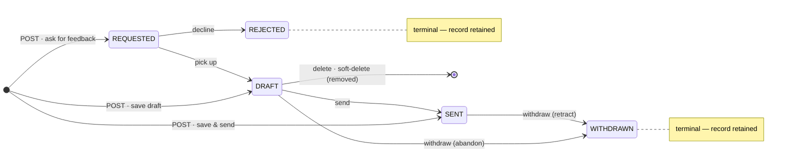

# CLAUDE.md

This file provides guidance to Claude Code (claude.ai/code) when working with code in this repository.

## Commands

Gradle wrapper is at `./gradlew` (use `gradlew.bat` on Windows). JDK 21 toolchain is required (auto-provisioned via foojay-resolver).

- Build everything: `./gradlew build`
- Run the server (Ktor + Netty on port 8080): `./gradlew :server:run`
- Run all tests: `./gradlew test`
- Run server tests only: `./gradlew :server:test`
- Run a single test: `./gradlew :server:test --tests "ch.nokillswit.ServerTest.security headers are set on responses"`
- Package the server for deployment: `./gradlew :server:installDist`. **Never use `:server:buildFatJar`** — the fat JAR breaks Flyway's `ServiceLoader` discovery and NPEs at startup (details in the `run-stack` skill).
- JVM memory flags are pre-tuned in `server/build.gradle.kts` (`applicationDefaultJvmArgs`) — rationale and per-deploy overrides in the `run-stack` skill.
- **Run the whole stack with one command: `docker compose up --build`** (only Docker required). See "Running the full stack" below.

## Running the full stack

`docker compose up --build` serves everything at `http://localhost:8080` (plus a Mailpit mail catcher at `http://localhost:8025` — password-reset emails land there); local dev is `docker compose up postgres` + `./gradlew :server:run` + `cd web && npm run dev`. Full detail — Kubernetes (OrbStack) deployment, secrets, teardown, the 3-stage `Dockerfile` — lives in the `run-stack` skill (`.claude/skills/run-stack/SKILL.md`).

## Architecture

Multi-module Gradle build (Kotlin DSL) defined in `settings.gradle.kts` with two Kotlin modules plus a separate JS frontend in `web/`:

- **`core`** — Kotlin Multiplatform (JVM target only currently). Shared code consumed by `server`. Holds the OpenTelemetry SDK bootstrap (`getOpenTelemetry(serviceName)`).
- **`server`** — Kotlin/JVM. The Ktor application. Depends on `core`.
- **`web/`** — Vite + React + TypeScript SPA that consumes the server's HTTP API. Standalone npm workspace; Gradle does not touch it.

Group is `ch.nokillswit`, version `1.0.0-SNAPSHOT` (set in root `build.gradle.kts`). Dependency versions are centralized in `gradle/libs.versions.toml`; Ktor itself comes from a separate version catalog (`ktorLibs`) loaded from `io.ktor:ktor-version-catalog` in `settings.gradle.kts`.

### Server bootstrap model

`server/src/main/kotlin/main.kt` just delegates to `io.ktor.server.netty.EngineMain`. The application is wired declaratively in `server/src/main/resources/application.yaml` under `ktor.application.modules` — each entry is a fully-qualified extension function on `Application` (e.g. `ch.nokillswit.plugins.HttpKt.configureHttp`). To add a new cross-cutting concern, create a new `configureXxx()` extension under `plugins/` and register it in `application.yaml`; do not call it from `main.kt`.

### Package layout

```
ch.nokillswit
├── main.kt
├── plugins/            cross-cutting Ktor wiring (configureXxx that only `install` plugins)
├── infra/db/           Flyway migrations + R2DBC connection bootstrap
├── infra/paging/       list-endpoint paging/sort/filter helper (parsePaging, applyPaging)
├── infra/mail/         outbound email: Mailer (smtp via Jakarta/Angus, log, disabled) + configureMail (see "Outbound email")
├── infra/crypto/       field-level encryption: FieldCipher (AES-256-GCM) + configureCrypto (see "Encryption at rest")
├── audit/              security audit trail: `audit(event, fields…)` → AUDIT-marked structured logs (see "Audit trail")
├── authz/              RBAC guards + CallerPrincipal (see "Authorization model")
├── auth/               POST /api/v1/login, /api/v1/refresh, /api/v1/logout, /api/v1/password-reset + token minting + password hashing + LoginThrottle/PasswordResetThrottle
├── users/              /api/v1/users/* CRUD + list + mass CSV import + UserService + Users table
├── teams/              /api/v1/teams/* CRUD + list + member sub-resource + TeamService + Teams/TeamMembers tables
├── templates/          /api/v1/templates/* CRUD + list + TemplateService + Templates table (read: any authenticated; write: ADMIN)
├── feedbacks/          /api/v1/feedbacks/* CRUD + list + FeedbackService + Feedbacks table + FeedbackVisibility
├── oneonones/          /api/v1/one-on-ones/* CRUD + list + events + action-item history + OneOnOneService + Meetings/Notes/ActionItems tables (see "1:1 meetings")
├── notifications/      /api/v1/notifications/* list + read + seen/unseen + delete + NotificationService + Notifications table (recipient-scoped)
└── alerts/             /api/v1/alerts/* CRUD + list (ADMIN-only) + /api/v1/alerts/visible (any authenticated) + AlertService + Alerts table (see "Alerts")
```

Routing is feature-local: each feature package registers its own routes from its `configureXxx` module. `plugins/Routing.kt` owns only the SPA: when `WEB_STATIC_DIR` (config key `web.staticDir`) is set, `configureRouting` installs `singlePageApplication` to serve `web/dist` with an `index.html` fallback; when unset (local dev / tests, where Vite serves the SPA), it installs no routes at all (there is no `GET /` placeholder). The scaffolding demo endpoints (`/ws`, `/json/kotlinx-serialization`, `/session/increment`, the "Hello, World!" root) and their plugins (`Sessions`, `Websockets`, the `GreetingService` DI sample, the inert `RequestValidation` rule) have been removed.

Module load order in `application.yaml` matters for inter-module attribute reads: `configureSecurity` puts `JwtConfigKey` in `attributes`; `configureCrypto` (`infra/crypto/Crypto.kt`) puts `FieldCipherKey`; `configureDatabase` reads `FieldCipherKey` (it hands the cipher to `FeedbackService`) and puts `UserServiceKey`; `configureBootstrap` reads `UserServiceKey` and `FeedbackServiceKey` (so it runs right after Database); `configureAuthRoutes` reads `JwtConfigKey` + `UserServiceKey` (and the blocklist key), and `configureUserRoutes` reads `UserServiceKey` (its `authenticate {}` blocks also need `configureSecurity` installed first), so the feature modules must run after both. Current order: plugins → infrastructure (Mail → Crypto → Flyway → Database → Bootstrap) → features (users, auth, teams, templates, feedbacks, oneonones, notifications, alerts) → catch-all `configureRouting`.

### Persistence

PostgreSQL is the only database. Connection settings come from the `postgres:` block in `application.yaml` (env-overridable via `POSTGRES_JDBC_URL`, `POSTGRES_R2DBC_URL`, `POSTGRES_USER`, `POSTGRES_PASSWORD`); defaults match the `docker compose up postgres` service. There is one persistence stack:

- **Flyway** (`infra/db/Flyway.kt`) — runs schema migrations from `server/src/main/resources/db/migration/` at startup via the Java API, opening a short-lived JDBC connection. Migrations are the single source of truth for schema; do not call `SchemaUtils.create` anywhere.
- **Exposed + R2DBC** (`infra/db/Database.kt` + `users/UserService.kt`) — runtime DB access. `Database.kt` connects the `R2dbcDatabase` and publishes `UserServiceKey`; the service itself lives next to the feature it serves. The Exposed table objects (e.g. `UserService.Users`) are used for queries only, not DDL.

The `org.postgresql:postgresql` JDBC driver is on the classpath solely for Flyway; runtime queries go through R2DBC.

Current migrations are `V1`–`V24`: schema for users/teams/feedbacks/revoked-tokens; the `users.role` column (`V5`); the `admin@lettuce.local` seed (`V6`); soft-delete `marked_as_deleted` columns (with index) on `users` (`V7`), `teams` (`V8`), `templates` (`V16`), `notifications` (`V17`), and `feedbacks` (`V19`); a demo-org seed (`V9`); a feedback templates table (`V10`); the `REJECTED` feedback status (`V11`); a feedback `last_modified` column (`V12`); the `notifications` table (`V13`); a seed of four default feedback templates (`V14`, idempotent via `ON CONFLICT (name)`); the `feedback_events` audit table (`V15`, `ON DELETE CASCADE` from `feedbacks`); partial unique indexes that free `templates.name` (`V16`) and `users.email` (`V18`) on soft-delete (see "Soft delete" below); the nullable `feedbacks.requester_message` column (`V20`, see "Requester message" under "Feedback lifecycle"); `users.password_changed_at` (`V21`, epoch millis, `0` = never — used to invalidate refresh tokens on password change, see "Session auto-extension"); the `alerts` table (`V22`, soft-delete column included — see "Alerts"); the 1:1 meeting tables (`V23` — `one_on_one_meetings` with soft-delete, plus the hard-deleting detail tables `one_on_one_notes` and `one_on_one_action_items`, the latter with a self-FK `copied_from_id ON DELETE SET NULL` carry-over chain); and the `one_on_one_events` audit table (`V24`, a clone of `V15` — see "1:1 meetings"). The `feedback_events` table (`V15`) stores events **structurally** (`event_type` + a JSON `params` map) so the SPA localizes them — see "Feedback events".

### Soft delete (convention)

`users`, `teams`, `templates`, `notifications`, `feedbacks`, `alerts`, and `one_on_one_meetings` are **soft-deleted** — rows are flagged, never physically removed. Only the join/audit/detail tables (`team_members`, `feedback_events`, `revoked_tokens`, `one_on_one_events`, and the 1:1 detail tables `one_on_one_notes`/`one_on_one_action_items`, whose rows hard-delete on full-document replace) hard-delete. (`feedback_events`/`one_on_one_events` keep their `ON DELETE CASCADE` FKs, but they never fire now — events outlive a soft-deleted parent.) To add soft-delete to a new entity, follow the established pattern (reference implementation: `users/UserService.kt`):

1. **Migration** — `ALTER TABLE <t> ADD COLUMN marked_as_deleted BOOLEAN NOT NULL DEFAULT FALSE;` plus `CREATE INDEX idx_<t>_marked_as_deleted ON <t>(marked_as_deleted);` (see `V7`/`V8`/`V16`/`V17`).
2. **Exposed table** — add `val markedAsDeleted = bool("marked_as_deleted").default(false)` and a private helper `fun active(): Op<Boolean> = <T>.markedAsDeleted eq false`.
3. **Filter every read** — `read`, `list`, `count`, and any lookup (e.g. `findByEmail`) get `… and active()`. Apply it in the shared list predicate so the `count()` (total) and the row select stay consistent.
4. **`delete` flips the flag** — `update({ (id eq id) and (markedAsDeleted eq false) }) { it[markedAsDeleted] = true }`, returning the affected-row `Int`; guard `update` mutations the same way. The route maps `0 → 404`, so a missing-or-already-deleted row is `404` (not `204`) and delete stays idempotent in effect.
5. **Routes need no special-casing** — they already key `404`/`204`/`NoContent` off the row-count and the `active()`-filtered `read`.

**Freeing a unique business field on delete.** To let a value be reused once its holder is soft-deleted, replace the global `UNIQUE` with a **partial unique index** over active rows: drop the original `<t>_<col>_key` constraint, then `CREATE UNIQUE INDEX uq_<t>_<col>_active ON <t>(<col>) WHERE marked_as_deleted = false;`. Drop the Exposed `.uniqueIndex()` on that column (Exposed defs are query-only — the DB enforces it). A clash with an **active** row still raises `23505 → 409`. In place today: `users.email` (`uq_users_email_active`, `V18`) and `templates.name` (`uq_templates_name_active`, `V16`). Seeds using `ON CONFLICT (<col>)` keep working because they run on earlier migrations, while the global constraint still exists.

### List endpoint conventions

`GET /api/v1/users`, `GET /api/v1/teams`, `GET /api/v1/teams/members`, `GET /api/v1/feedbacks`, `GET /api/v1/one-on-ones`, `GET /api/v1/templates`, `GET /api/v1/notifications`, and `GET /api/v1/alerts` are list endpoints; every list endpoint follows the rules below. The OpenAPI spec is the contract; document the query params for each list endpoint there. (`teams/members` is caller-relative via `view=member|managed|managers`; `managed` additionally accepts the strict-boolean `includeIndirect` to widen from direct reports to the transitive management chain — same param and semantics as `GET /api/v1/feedbacks?view=team`, `400` with any other view. `managers` and `managed` items are additionally enriched **route-side** with per-person dashboard stats, direction switched per view — latest directional 1:1 + its open action items via `OneOnOneService.latestMeetingStats` / `latestMeetingStatsBySubordinate`, last SENT feedback via `FeedbackService.lastProvidedAt` (received-scoped: only feedback the caller can see) / `lastProvidedTo` (provider-side: never visibility-filtered) — SENT moment from `feedback_events`, pre-V15 rows fall back to `lastModified`; `managed` rows are enriched regardless of `includeIndirect`; `member` items instead carry both peer feedback directions at once — `lastFeedbackGivenAt` via `lastProvidedTo`, `lastFeedbackReceivedAt` via `lastProvidedAt` — with no 1:1 stat.)

**Pagination — offset, in the body envelope.**

- Query params: `page` (1-based, default `1`, must be ≥ 1) and `pageSize` (default `20`, max `100`). Out-of-range values → `400` + `ProblemDetail`.
- Response is always an envelope, never a bare array:
  ```json
  { "items": [ ... ], "page": 1, "pageSize": 20, "total": 137 }
  ```
- `total` is the row count after filters but before pagination. Count and page rows run in the same `suspendTransaction { ... }` so they stay consistent.
- Cursor pagination is not the default; add it only per-endpoint when stable ordering under heavy concurrent writes is actually needed, and document the cursor format in that endpoint's OpenAPI definition.

**Sorting — `sort` with leading `-` for descending.**

- `sort=field` (asc) or `sort=-field` (desc). Multi-field is comma-separated, leftmost wins: `sort=-lastModified,id`.
- Each endpoint declares an explicit whitelist of sortable fields in its `*Routes.kt`; unknown field → `400`.
- Always append `id` ascending as a deterministic tiebreaker so paging is stable.
- Default sort, if the client sends none, is `id` ascending — state it in the OpenAPI description.

**Filtering — whitelisted equality, plus a few operators where needed.**

- Equality on whitelisted fields: `?status=DRAFT&providerId=42`. Unknown fields → `400`.
- Repeating a key is reserved to mean `IN` (`?status=DRAFT&status=SENT` → `status IN ('DRAFT', 'SENT')`) — but **no endpoint implements it yet**: the shared parser (`optionalString` in `infra/paging/QueryParams.kt`) reads only the first value of a repeated key. Implement per-endpoint (and update this line) when a UI actually needs it.
- Range/operator filters use bracket suffixes — only the ones a given endpoint actually needs:
  - `field[gte]`, `field[gt]`, `field[lte]`, `field[lt]` for ordered types (timestamps, numbers).
  - No `[like]`, no `[ne]`, no `[in]` (use repetition for `IN`). Keep the operator surface tiny.
- Free-text search uses a single `q` param. The endpoint decides which columns `q` searches (e.g. users: `name`, `email`); document the searched columns in OpenAPI. **No endpoint implements `q` yet** — the current UIs use per-column filters; add it (and the reusable `Q` parameter below) with the first endpoint that needs it.
- Per-column substring search is also allowed when a UI genuinely needs per-column matching that `q` cannot express. The filter param uses the column name directly (e.g. `?name=ali`), is case-insensitive `contains`, and must be documented per-endpoint. First example: `GET /api/v1/users` uses `name` and `email` this way. Reach for `q` first; promote to per-column only when the UI requires it.
- Booleans are `true`/`false`. Enums use their string name. Malformed values → `400`.

**Naming and OpenAPI plumbing.**

- Param names are `camelCase` to match existing JSON bodies (`pageSize`, not `page_size`).
- Add reusable parameters `Page`, `PageSize`, `Sort` (and `Q`, once a `q` endpoint exists) to `#/components/parameters` in `documentation.yaml`, then `$ref` them from each list path. Per-endpoint sortable/filterable fields go in that path's `parameters` list with a `description` listing the whitelist.
- Pagination envelopes are one schema per resource (`UserPage`, `TeamPage`, …) wrapping the existing `*Response[]` — keep them next to the resource's other schemas.

**Implementation.**

- The shared helper lives at `infra/paging/Paging.kt`: `ApplicationCall.parsePaging(...)` parses `page`/`pageSize`/`sort` from the query string and validates against per-endpoint whitelists into a `PageRequest`; `Query.applyPaging(req, columns)` applies `.limit(...).offset(...)` + `.orderBy(...)` to an Exposed `Query`. Validation failures throw a typed exception that `StatusPages` maps to `400` + `ProblemDetail`. New list endpoints reuse these rather than re-parsing params.

### Security posture: development vs production mode

`ktor.development` is env-overridable (`$KTOR_DEVELOPMENT:true`): local `:server:run`/tests default to development mode; **the Docker image ships `KTOR_DEVELOPMENT=false`** (production mode), and `docker-compose.yaml` explicitly sets it back to `true` because it is the local plain-HTTP demo. Production mode activates HSTS + HTTPS redirect and four **fail-closed startup checks**:

- **JWT secret** (`plugins/Security.kt`): blank, the placeholder `"secret"`, the repo-committed compose demo key (`dev-only-9f3c…`), or the `k8s/secret.yaml` template placeholder → warn in development, **refuse to start** in production. Set a strong private `JWT_SECRET`.
- **Data encryption key** (`infra/crypto/Crypto.kt`): blank or one of the two repo-committed dev keys → warn in development, **refuse to start** in production; a malformed key (not 64 hex chars) refuses to start in **any** mode. Set a strong private `DATA_ENCRYPTION_KEY`. See "Encryption at rest" below.
- **Mail transport** (`infra/mail/Mail.kt`): `mail.transport=log` writes outbound email (including generated passwords) into the application log — permitted with a warning in development, **refuse to start** in production; `smtp` with a blank host refuses to start in **any** mode. See "Outbound email" below.
- **Seed passwords** (`infra/db/Bootstrap.kt`, module `configureBootstrap`, runs after `configureDatabase`): in production mode the V9 demo users are **soft-deleted at startup**, and if any active account still carries the well-known `changeme` bcrypt hash the app **refuses to start**. Setting `ADMIN_INITIAL_PASSWORD` (config `bootstrap.adminInitialPassword`) rotates the V6 seed admin's password at startup — idempotent: only applied while the admin still has the seed hash, so an admin-chosen password is never overwritten. Covered by `BootstrapTest`; seed-mutating tests restore state via `TestSeedState.restoreSeedAccounts()` (`TestEnvironment.kt`).

**Per-account login lockout** (`auth/LoginThrottle.kt`, wired in `configureAuthRoutes`): after `security.lockout.threshold` (default 5, `$LOGIN_LOCKOUT_THRESHOLD`) consecutive failures for one submitted email, `/login` answers `429` for `security.lockout.durationSeconds` (default 900) — even with the correct password, and regardless of whether the account exists (no enumeration signal). A success resets the counter. In-memory and per-instance by design (single-replica deployment; a restart only resets the throttle). Complements the per-IP `RateLimit` bucket, which rotating hosts sidestep. Tests: `LoginThrottleTest` (unit, injected clock) + `LoginLockoutTest` (route). The SPA maps the 429 to `auth.accountLocked`.

**Self-service password reset** (`POST /api/v1/password-reset`, in `auth/AuthRoutes.kt`; SPA: "Forgot password?" on `/login` → `/reset-password`): body `{email}`; always `202` for a well-formed request — account existence is unobservable (the lookup/generate/send/store work runs **asynchronously** after the response, so latency is uniform too). If the account exists, a new 16-char password is generated server-side (`generatePassword` in `auth/Passwords.kt`), the email is sent **first** and only then the bcrypt hash stored via `UserService.updatePassword` (a delivery failure leaves the old password working); the `password_changed_at` stamp invalidates outstanding refresh tokens. Throttled per submitted email — one request per `security.passwordReset.minIntervalSeconds` (default 60, `$PASSWORD_RESET_MIN_INTERVAL_SECONDS`) — uniformly for existing and unknown addresses (`auth/PasswordResetThrottle.kt`, in-memory/per-instance like the lockout), plus a per-IP `RateLimit` bucket (5/min). `503` when the deployment has no outbound email (`MAIL_TRANSPORT=disabled`). The email body is bilingual EN+PL (`auth/PasswordResetEmail.kt`), includes a sign-in link only when `mail.appUrl` is set, and warns the recipient that their previous password no longer works. Tests: `PasswordResetThrottleTest` (unit) + `PasswordResetTest` (route, incl. full email→login roundtrip via a `ListAppender` on the `ch.nokillswit.mail` logger).

**Outbound email** (`infra/mail/`): `configureMail` (registered before the features) publishes `MailerKey` holding a `Mailer` or null. `mail.transport` (`$MAIL_TRANSPORT`) selects `log` (dev default — the full message, **including generated passwords**, goes to the `ch.nokillswit.mail` logger; **production mode refuses to start on it**), `smtp` (Jakarta/Angus Mail over `mail.smtp.*` / `$SMTP_HOST` etc.; a blank host refuses startup in any mode), or `disabled` (the Docker image default via `ENV MAIL_TRANSPORT=disabled` — email features answer 503). The compose demo wires `smtp` → the bundled Mailpit (`http://localhost:8025`); k8s ships `disabled` with `SMTP_USER`/`SMTP_PASSWORD` read (optional) from `lettuce-secrets`.

**Swagger/OpenAPI gate** (`plugins/Http.kt`): `/openapi` (UI + spec) is served only in development mode, or when `http.exposeOpenApi` (`$HTTP_EXPOSE_OPENAPI`) is explicitly `"true"` — blank follows the mode, `"false"` hides it even in dev. Bearer auth cannot protect a browser-loaded UI (page loads carry no `Authorization` header), hence a gate rather than `authenticate {}`.

**Request payload validation (convention).** Mutating routes validate payloads up-front and throw `BadRequestException` (→ `400` + `ProblemDetail`) instead of letting oversized/blank values die in the DB as `500`s: users `name` ≤50/`email` ≤254 + `'@'` + non-blank (`validateNameAndEmail`, `users/UserRoutes.kt`), create password ≥ `MIN_PASSWORD_LENGTH`, team/template `name` non-blank ≤100 (feature-local `validate*` helpers in their `*Routes.kt`). Keep new validators feature-local and enforce them **after** the authz guard (403 wins over 400 for non-admins). Covered by `PayloadValidationTest`.

**CORS is off by default** (`plugins/Http.kt`): the plugin is installed only when `http.corsHosts` (`$CORS_ALLOWED_HOSTS`, comma-separated hosts) is non-empty. Production is single-origin (Ktor serves the SPA) and dev goes through the Vite proxy, so no cross-origin caller exists by default — `anyHost()` is gone. **Reverse proxy**: set `HTTP_BEHIND_PROXY=true` (config `http.behindProxy`) when TLS terminates at an ingress/proxy — it installs `XForwardedHeaders` so rate-limit buckets key on the real client IP and the HTTPS redirect sees the real scheme; the proxy must set (and strip client-supplied) `X-Forwarded-For`/`X-Forwarded-Proto`. Off by default because honoring those headers from direct clients lets them spoof both.

CSRF install is gated behind `security.csrf.enabled` (default **`false`** in `application.yaml`, env-overridable via `SECURITY_CSRF_ENABLED`); the configured `originMatchesHost()` + `allowOrigin("http://localhost:8080")` + `checkHeader("X-CSRF-Token")` combo is unsatisfiable from both the Ktor test client and the dev SPA on `:5173`, and CSRF protection is anyway moot for this app's bearer-JWT auth model — browsers do not auto-attach `Authorization` headers, so cross-site forms cannot forge an authenticated request. Re-enable only if you move to cookie-based session auth and fix the allow-list accordingly.

**Default admin & demo seed.** Migration `V6__seed_admin.sql` inserts a single bootstrap administrator on first boot: `admin@lettuce.local` / `changeme` (role `ADMIN`), idempotent via `ON CONFLICT (email) DO NOTHING`. `V9__seed_demo_users_and_teams.sql` additionally seeds a demo org (teams AAA/BBB/CCC with `aaa-one@…`, `manager-aaa@…`, etc.) so the dashboard lists have data — every demo user is role `USER` and logs in with `changeme` (reusing V6's bcrypt hash). The migrations are kept **unchanged** (dev + e2e depend on them; checksums must not change) — production neutralizes them at startup via the bootstrap above. **Kubernetes secrets** live in the `lettuce-secrets` Secret (`k8s/secret.yaml` is a placeholder template — create the real one out-of-band with `kubectl create secret generic`; both deployments consume it via `secretKeyRef`).

### Encryption at rest (feedback content)

`feedbacks.content` and `feedbacks.requester_message` are encrypted **by the application** before they reach PostgreSQL (AES-256-GCM, fresh random nonce per value, envelope `enc:v1:<base64(nonce||ciphertext+tag)>`). Threat model: a database-level attacker — SQL access, a `pg_dump`/backup, a stolen volume — sees only ciphertext; the key lives with the app (env/k8s Secret), never in the DB. It does **not** protect against compromise of the app host/env (the key is there) or an attacker holding valid API credentials. Infra-level encryption (disk/TDE) would not address the DB-level threat at all — it is transparent to SQL.

- **Implementation**: `infra/crypto/FieldCipher.kt` (the cipher; plain JDK `javax.crypto`, no deps) + `infra/crypto/Crypto.kt` (`configureCrypto`, publishes `FieldCipherKey`; registered before `configureDatabase`). `FeedbackService` encrypts on write (`create`, `editContent`) and decrypts on read (`toFeedback()`, the list preview) — nothing above the service ever sees ciphertext, so routes/spec/SPA are untouched. Neither column is filtered/sorted/searched in SQL (the preview is `.take(200)` in Kotlin), so queries are unaffected; **never add a SQL-level filter/sort on these columns** — it would silently operate on ciphertext.
- **Key**: `DATA_ENCRYPTION_KEY` (config `security.encryption.key`), 64 hex chars (`openssl rand -hex 32`). The application.yaml default and the compose value are committed, therefore **burned** (constants in `Crypto.kt`; production refuses them — see the fail-closed list above). **Losing the key means losing all feedback content permanently** — back it up separately from (never inside) the DB backups.
- **Legacy plaintext / backfill**: `decrypt` passes non-enveloped values through unchanged, and `configureBootstrap` runs `FeedbackService.encryptLegacyRows()` at every boot — pre-encryption plaintext rows (including soft-deleted ones) are encrypted once, idempotently.
- **Rotation**: set the new key as `DATA_ENCRYPTION_KEY` and the old one as `DATA_ENCRYPTION_KEY_PREVIOUS` (decrypt-only fallback), boot once — the backfill re-encrypts **every** row under the current key — then remove the previous key.
- **Tests**: `FieldCipherTest` (unit) + `FeedbackEncryptionTest` (raw-column assertions, backfill, rotation, fail-closed). Production-mode boot tests must override `security.encryption.key` with `strongEncryptionKey()` (`TestEnvironment.kt`), since the dev default is burned — and `mail.transport` with `"disabled"`, since the dev-default `log` transport is likewise refused in production. `TestServices.feedbacks` shares the dev-default cipher so service-level writes interoperate with the booted app's reads.
- Encrypting more fields elsewhere: reuse `FieldCipher` via `attributes[FieldCipherKey]` and follow the same write/read wrap pattern; notification/event `params` (party names, enum values) are deliberately **not** encrypted — `users.name` is plaintext anyway.
- **Also encrypted the same way**: `one_on_one_notes.content` and `one_on_one_action_items.content` (`OneOnOneService`, same write/read wrap; carry-over copies re-encrypt with a fresh nonce). Their `encryptLegacyRows()` rotation hook runs from `configureBootstrap` next to the feedback one — do not remove either. 1:1 event `params` carry positions/dates/enum names only, **never item text** (pinned by `OneOnOneEncryptionTest`).

### Authorization model

Layered RBAC. Implemented in the `server/src/main/kotlin/authz/` package.

- **Global roles** live on `users.role` (`ADMIN` / `USER`, added by `V5__add_user_role.sql`). `ADMIN` bypasses every per-resource check **except feedback writes** — admins may read every feedback but may not edit, delete, or transition existing ones (see `canWriteFeedback`); an admin who is the feedback's provider keeps write access via the ordinary provider rule. New users default to `USER`; only an `ADMIN` may set or change the field via the API.
- **Login** issues a **pair** of JWTs, both carrying `email`, `userId`, `role`, and a `typ` claim (`"access"` / `"refresh"`), minted by `auth/Tokens.kt` (`JwtConfig.issueAccessToken` / `issueRefreshToken`). The short-lived **access** token (`jwt.accessExpiresInSeconds`, default 900) is the API bearer; the longer-lived **refresh** token (`jwt.refreshExpiresInSeconds`, default 3600) is exchanged at `POST /api/v1/refresh` for a fresh pair. `LoginResponse` (also the `/refresh` response) exposes `token`/`expiresAt`, `refreshToken`/`refreshExpiresAt`, `userId`, and `role`. The `jwt {}` verifier in `plugins/Security.kt` additionally requires `typ == "access"`, so a refresh token cannot authenticate an API call.
- **Session auto-extension (pure sliding).** `/api/v1/refresh` (rate-limited, no `authenticate` — the access token may be expired) verifies the refresh token's signature/issuer/audience/`typ`/non-revocation, then does **one** `userService.read(userId)` to confirm the user is still active and pick up their current role, **rejects tokens whose `iat` predates `users.password_changed_at`** (compared at second granularity — JWT `iat` is second-precision; a missing `iat` counts as epoch 0), and mints a fresh pair. Superseded tokens are **not** rotated out — they stay valid until their own expiry (no blocklist write on refresh); only an idle session (no refresh within the refresh TTL) ends. `/api/v1/logout` revokes the access `jti` (from the principal) **and**, if the client sends the refresh token in the body (`LogoutRequest`), that token's `jti` too. Frontend: `web/src/api/client.ts` `authedFetch` silently refreshes (single-flighted via a module-level in-flight promise) and retries once on a `401`; on refresh failure it clears the session and signs out.
- **Guards** in `authz/Guards.kt` are plain `suspend fun` calls used at the top of each route handler — there is no Ktor plugin or DSL. Each route reads `call.caller()` (which parses the JWT claims into a `CallerPrincipal`) and then invokes the relevant guard.
- **Resource rules**:
  - `POST /api/v1/users`, `DELETE /api/v1/users/{id}` → ADMIN only. Create accepts `sendEmail: true` to mail the new user their credentials (same welcome email as the import; `emailSent` in the `UserCreateResponse` reports the outcome, a delivery failure keeps the account; `503` up-front on a mail-less deployment).
  - `POST /api/v1/users/import` → ADMIN only. Mass CSV import (`name,email` per line, split on the LAST comma so names may contain commas; an optional literal header and blank lines are skipped): every row imports independently as role `USER` with a server-generated password returned once per row (statuses `CREATED`/`DUPLICATE`/`PARSE_ERROR`/`EMAIL_FAILED`/`ERROR`); duplicates are classified via the 23505 cause-chain check (`isUniqueViolation`, internal in `plugins/ErrorHandling.kt`). `sendEmails: true` sends each new user a bilingual welcome email (`users/WelcomeEmail.kt`) — rejected `503` up-front on a mail-less deployment; a per-row delivery failure keeps the account (`EMAIL_FAILED`, password still in the row). Caps: 200 rows / 256 KiB → `400`. SPA: Users → "Mass import" → `/users/import`. A demo file exercising every status lives at `samples/user-import-demo.csv`. Tests: `UserImportTest` + `UserImportParserTest` (the pure parser in `users/UserImport.kt`).
  - `GET /api/v1/users/{id}`, `PUT /api/v1/users/{id}` → caller must be the target user or ADMIN; only ADMIN may change `role`.
  - `PUT /api/v1/users/{id}/password` → target user or ADMIN. New password must be ≥ 10 chars (`MIN_PASSWORD_LENGTH` in `users/UserRoutes.kt`, else `400`). A **self-change** (even by an admin) additionally requires a correct `currentPassword` in the body (else `403`); an admin resetting **another** user's password does not. A successful change stamps `users.password_changed_at`, which invalidates all outstanding refresh tokens (see "Session auto-extension"); already-issued access tokens keep working until their ≤15-min expiry (documented bounded window). Covered by `PasswordChangeTest`.
  - `POST /api/v1/teams` → caller must designate themselves as `managerId` (ADMIN may designate anyone).
  - `GET /api/v1/teams/{id}` → any authenticated user.
  - `GET /api/v1/teams/members` → any authenticated user; caller-relative scoping only (`view=member|managed|managers`, plus `includeIndirect` on `managed` — see "List endpoint conventions").
  - `PUT /api/v1/teams/{id}`, `DELETE /api/v1/teams/{id}`, member sub-resource mutations → the team's current `manager_id` or ADMIN. **Reassigning the manager** (changing `manager_id` to a different user on `PUT`) is **ADMIN-only** (`requireCanReassignManager`); a current manager may edit their team but not hand it off.
  - `POST /api/v1/feedbacks` → the caller must be a **party** to what they create: their `userId` must equal the `providerId` (they author it) or the `requesterId` (they ask for it); ADMIN may create on behalf of anyone. This blocks authoring feedback as someone else / forging a request from someone else. The create-time invariants also apply (see "Feedback lifecycle").
  - `GET /api/v1/feedbacks/{id}` → `canReadFeedback` (`authz/Guards.kt`), evaluated in order: **ADMIN** and the **provider** see everything; the **requester** sees it at any status, but only when visibility is `PROVIDER_REQUESTER`/`PROVIDER_REQUESTER_SUBJECT`; the **subject** sees it only when visibility is `PROVIDER_SUBJECT`/`PROVIDER_REQUESTER_SUBJECT` **and** status is `SENT`/`WITHDRAWN`; a **manager in the subject's management chain** (their team's manager, that manager's manager, and so on — transitive over non-deleted teams, cycle-safe) is handled outside `canReadFeedback` — the route uses `requireFeedbackReadAllowingManager` (backed by `FeedbackService.managesSubject`), which grants a managing caller read **only once the feedback is delivered** (status `SENT`/`WITHDRAWN` — matching the team list's delivered-only rule; the list's direct-only default is a narrower slice of this same right, not a separate authorization); a provider's `DRAFT`/`REQUESTED` work stays private to the parties involved; finally `PUBLIC` + `SENT` is readable by anyone. Anything else is **default-deny** — an ordinary outcome (every unauthorized attempt and every manager read lands there first), recorded when it becomes an actual 403 by the `authz.denied` audit event. Whether the **content** (vs. mere existence) is shown is a separate gate, `canReadFeedbackContent`: a requester watching an unfinished (`DRAFT`/`REQUESTED`) feedback sees that it exists but not its content.
  - `PUT/DELETE /api/v1/feedbacks/{id}` and the transition actions (`POST …/{id}/send|withdraw|reject|pick-up`) → the row's `provider_id` **only** (`canWriteFeedback`); ADMIN can read but **not** modify feedbacks (unless the admin is themselves the provider). `PUT` edits **content/visibility only**; status changes go through the POST action endpoints, and a transition invalid for the current status (see "Feedback lifecycle") is `409`.
  - `POST /api/v1/one-on-ones` → the caller **is** the manager (no ADMIN create-on-behalf — the manager is always the author) AND the `subordinateId` is a **direct report** (member of a non-deleted team the caller manages) at creation time, else `403`. `GET /api/v1/one-on-ones/{id}` (and `…/events`, `…/action-items/{id}/history`) → the manager, the subordinate, ADMIN, or any **manager in the subordinate's transitive management chain** (`requireOneOnOneReadAllowingManager`). `PUT`/`DELETE /api/v1/one-on-ones/{id}` → the meeting's `manager_id` **only** (`requireOneOnOneWrite` — ADMIN gets no write access, mirroring feedback writes), and **only the pair's latest meeting** (older → `409`, see "1:1 meetings"). See "1:1 meetings".
  - `GET /api/v1/templates`, `GET /api/v1/templates/{id}` → any authenticated user; `POST`/`PUT`/`DELETE /api/v1/templates/*` → ADMIN only (`requireAdmin`). Routes in `templates/TemplateRoutes.kt`; list is sortable by `id`,`name` with a `name` substring filter.
  - `GET/POST/DELETE /api/v1/notifications/*` → the notification's `recipient_id` only (via `requireNotificationRecipient`); ADMIN bypasses. Notifications are never created through the API — see "Notifications" below.
  - `GET/POST/PUT/DELETE /api/v1/alerts` and `/api/v1/alerts/{id}` → ADMIN only (`requireAdmin`), **reads included** (unlike templates — non-admins have no use for the management view). `GET /api/v1/alerts/visible` → any authenticated user. See "Alerts" below.
- **Existence disclosure (403 vs 404) — deliberate policy**: `GET /users/{id}` guards **before** reading, so a non-admin probe gets a uniform 403 whether or not the id exists; feedback and notification GETs read **before** guarding (missing → 404, existing-but-forbidden → 403), so an id probe can learn that a record exists (never its content or parties). Accepted knowingly: ids are sequential (existence is no secret) and the feedback read matrix already deliberately reveals existence-without-content to requesters. New resources should pick one of these two idioms consciously rather than mixing them.
- **Exceptions**: `UnauthorizedException` (→ 401) and `ForbiddenException` (→ 403) are mapped in `plugins/ErrorHandling.kt`. **All error bodies are RFC 7807 `application/problem+json`** (`ProblemDetail{type,title,status,detail,instance}`) — emit them via the `ApplicationCall.respondProblem(status, detail)` helper (it uses an explicit `TextContent` so ContentNegotiation does not relabel the media type as `application/json`). `StatusPages` routes `BadRequestException`→400, `UnauthorizedException`→401, `ForbiddenException`→403, `TooManyRequestsException`→429 (the login lockout — thrown, never `respondProblem`ed directly, see below), unique-violation→409, and a catch-all `Throwable`→500 (logged) through that helper; a `status(TooManyRequests)` handler additionally gives the per-IP `RateLimit` plugin's bodiless 429 a generic problem body — **that handler rewrites any non-StatusPages 429**, which is why caller-specific 429s must go through the exception (handled calls are marked and skipped). The JWT `challenge` in `plugins/Security.kt` also calls `respondProblem` (it runs outside `StatusPages`), and inline `404`s in routes use `respondProblem(NotFound, …)`. Test HTTP clients must register the `application/problem+json` content type (`json(contentType = ContentType.parse("application/problem+json"))`) to decode error bodies with `body<ProblemDetail>()`.
- **Tests**: `server/src/test/kotlin/AuthorizationTest.kt` covers the 401/403 paths and the full `FeedbackVisibility` matrix. The shared `TestUsers.seed` helper defaults to `role = ADMIN` so older tests keep working without modification; pass `role = UserRole.USER` when you need a non-privileged caller.

### Feedback lifecycle (statuses & transitions)

A feedback moves through a small state machine. The authoritative rules live in `feedbacks/FeedbackService.kt` — `isAllowedTransition` (the edges) and `validate` (the invariants); read/write authorization is in `authz/Guards.kt`. `FeedbackStatus` (`feedbacks/Feedback.kt`) has five values:

- **`REQUESTED`** — feedback has been requested of a provider (e.g. via "Ask for feedback"); awaits the provider picking it up or declining. **Requires a non-null requester.**
- **`DRAFT`** — the provider's private work in progress; **hidden from the subject** until it leaves `DRAFT`.
- **`SENT`** — delivered; visible to the subject / requester per `FeedbackVisibility`.
- **`WITHDRAWN`** — terminal; the provider retracted the feedback.
- **`REJECTED`** — terminal; the provider declined a request.



Create (`POST`) permits any status (no transition gate); the realistic entry points are
`REQUESTED`/`DRAFT`/`SENT`. `WITHDRAWN`/`REJECTED` are terminal records that are **retained**;
the `DRAFT → [*]` edge is the provider-only **soft-delete** (the row is flagged and drops out of
reads/lists, distinct from the retained terminal states). Details below.

**Allowed transitions** (anything not listed → `409` via `ConflictException` from `FeedbackService.transition`, mapped by `StatusPages`; `WITHDRAWN` and `REJECTED` are terminal with no outgoing edges):

| From → To | Who | Meaning |
|---|---|---|
| `REQUESTED → DRAFT` | provider | provider picks up the request |
| `REQUESTED → REJECTED` | provider | provider declines the request (terminal) |
| `DRAFT → SENT` | provider | deliver the feedback |
| `DRAFT → WITHDRAWN` | provider | abandon a draft (terminal) |
| `SENT → WITHDRAWN` | provider | retract a sent feedback (terminal) |

Every transition is performed via a dedicated **POST action endpoint** — `POST /api/v1/feedbacks/{id}/send` / `/withdraw` / `/reject` / `/pick-up` (no body; shared `transitionTo` handler in `feedbacks/FeedbackRoutes.kt`) — and is gated by `canWriteFeedback` (provider only — ADMIN does not get feedback write access), so only the provider can send, withdraw, pick up, or reject.

**Delete (separate from the transitions).** `DELETE /api/v1/feedbacks/{id}` **soft-deletes** a feedback (it disappears from reads/lists; the row and its audit trail are retained). It is **provider-only** (`canWriteFeedback`) and **DRAFT-only** — deleting a non-`DRAFT` feedback is `400` (other statuses use the terminal `WITHDRAWN`/`REJECTED` transitions instead). On delete the route records a deletion **audit event** (`feedbackDeletionEvent`) and, if the feedback has a requester, sends them a **notification with no link** that the provider deleted it (`feedbackDeletionNotifications`). Distinct from `DRAFT → WITHDRAWN`, which keeps the feedback visible as a terminal record.

**Creation vs. update.** On **create** (`POST`) any status is permitted — there is no transition gate, so the UI can create a feedback directly as `SENT` ("save & send") or as `REQUESTED` ("ask for feedback"). The transition check above applies only on **update**. The following invariants are enforced on **both** create and update: provider == subject is allowed (a **self-reflection**, see below — standalone or requested); requester ≠ provider; `REQUESTED` requires a requester; **a feedback with a requester may not use `PROVIDER_SUBJECT` visibility** (that visibility excludes the requester, so the combination is contradictory); and the mirror image, **`PROVIDER_REQUESTER` visibility requires a requester** (without one that visibility excludes everyone but the provider — and the subject's Received list would leak its preview).

**No-duplicate invariant.** Creation (any target status) is **409** while an active feedback in `DRAFT` or `REQUESTED` status exists with the same **(subjectId, providerId, requesterId)** triple — a null requester matches only null (`FeedbackService.findOpenDuplicate`, checked inside `create()`'s transaction; no DB unique index by design). The `ProblemDetail.instance` carries `/api/v1/feedbacks/{id}` of the existing record (`ConflictException(message, instance)` → `respondProblem`'s `instance` param). Pick-up (`REQUESTED → DRAFT`) is guarded the same way against a matching DRAFT (reachable only with pre-invariant duplicates). The SPA warns **before** the user fills anything: `GET /api/v1/feedbacks/duplicate-check?subjectId&providerId[&requesterId]` (party-scoped like creation — a matching row always has the caller as a party, so no unrelated draft's existence can be probed) → `{existingId, existingStatus}`; the four create screens (`CreateFeedback`/`SelfReflection` via `FeedbackForm`'s `duplicate` prop, `AskFeedback`, `RequestFeedback` per selected provider) render `components/DuplicateFeedbackAlert.tsx` with an edit link (provider) or view link (requester) and disable submission (`hooks/useFeedbackDuplicate.ts`). Covered by `FeedbackDuplicateTest` (server) and the create pages' SPA tests.

**Self-reflection (provider == subject).** A user may write feedback **about themselves**: same entity/lifecycle, `providerId == subjectId`. Two flavors: **standalone** (no requester — the SPA's Self-reflection screen; enters as `DRAFT`/`SENT`) and **requested** (a requester — never the subject themselves, since requester ≠ provider — asks the subject for a self-reflection via "Request feedback", whose provider picker deliberately offers the subject; enters as `REQUESTED` and triages/flows like any request). No other backend special-casing: the provider rules give the author full read/write at any status, and a manager in the author's chain reads it once delivered, exactly like any other feedback. Notifications for self rows: everything aimed at the subject/provider (the acting user) is dropped (`feedbackTransitionNotifications` filters recipients == provider when subject == provider); **requester- and manager-directed notifications survive** (neither recipient is the actor), worded via the `self` i18next context (`params.self` — `"self"` on the provider/transition/deletion/manager notes, `"reflection"` on the requester's request confirmation; keys `notifications.event.*_self`/`*_reflection`). A standalone self row therefore notifies only the author's direct managers once delivered (nothing at all when they have none). SPA entry point: the left-menu "Self-reflection" button (above "Change password") → `/feedback/self` (`web/src/pages/SelfReflection.tsx`, modeled on `CreateFeedback.tsx`): both parties are the caller ("You"), visibility offers only Provider+subject (default) / Public (the standard no-requester pair), and save/cancel land on `/feedback?tab=provided`. Tests: `SelfReflectionTest` (server), `SelfReflection.test.tsx` + `RequestFeedback.test.tsx` (SPA). Transition and invariant behavior is covered by `FeedbackRoutesTest` (transitions + the invariant) and `AuthorizationTest` (the `FeedbackVisibility` read matrix).

**Requester message.** A feedback carries an optional `requesterMessage` (`feedbacks.requester_message`, `V20`) — the requester's clarification note to the provider, captured by the "Ask for feedback" / "Request feedback" forms (`AskFeedback.tsx` / `RequestFeedback.tsx`). It is **set once at creation and never updated**: `FeedbackService.update` simply omits the column, so `PUT` cannot change it (no validation error — the field is ignored). The SPA displays it read-only via `web/src/components/RequesterMessage.tsx` (renders nothing when null/empty) on the view screen, the `REQUESTED` triage screen, and the `DRAFT` editor.

**Frontend: the `REQUESTED` decision screen.** Because `REQUESTED → SENT` is not a valid edge, the editor must not offer "Save & send" for a pending request. So `web/src/pages/EditFeedback.tsx`, when the loaded feedback is `REQUESTED` and the caller is its provider, renders a read-only **triage screen** (subject + requester names, no editor) instead of the `FeedbackForm` editor, with exactly three actions:

- **Close** — navigate back, change nothing.
- **Reject** — confirmation modal → `REQUESTED → REJECTED`, returns to the originating tab.
- **Accept** — `REQUESTED → DRAFT`, then **reloads in place** (invalidates the `["feedback", id]` query rather than navigating) so the same route re-renders as the normal `DRAFT` editor (Cancel / Save draft / Save & send). `handleSave` distinguishes this case via `accepted = data.status === "REQUESTED" && status === "DRAFT"` and skips the post-save navigate.

**Frontend: the DRAFT editor's Delete action.** The `DRAFT` editor (`FeedbackForm` via `EditFeedback.tsx`) shows a fourth action — a red **Delete** — alongside Cancel / Save draft / Save & send, but only when the caller is the draft's provider (`data.status === "DRAFT" && getUserId() === data.providerId`). It opens a confirmation `Modal` (mirroring the Reject modal) whose confirm calls `deleteFeedback(id)` → on success invalidates `["feedbacks"]`/`["feedback", id]` and navigates to the originating tab. `FeedbackForm` takes optional `onDelete`/`deleting` props and renders the button only when `onDelete` is set.

`FeedbackForm` is therefore only ever the editor for `DRAFT` and the create flows; it carries no reject affordance. This mirrors the backend state machine in the UI (defense-in-depth, not a relaxation of the server check). Covered by `web/src/pages/EditFeedback.test.tsx`.

**Frontend: the simplified requester view.** On the read-only view (`web/src/pages/ViewFeedback.tsx`), when the caller is the **requester** and the feedback is unfinished (`REQUESTED`, `DRAFT`) or declined (`REJECTED`), the **Content** section is hidden — mirroring the server's `canReadFeedbackContent` redaction. The gate is `isRequester && (status === "REQUESTED" || status === "REJECTED" || status === "DRAFT")` (`isRequester = data.requesterId != null && getUserId() === data.requesterId`); every other viewer and status still renders Content. Covered by `web/src/pages/ViewFeedback.test.tsx`.

### Feedback list views (`GET /api/v1/feedbacks?view=…`)

`FeedbackService.list` (`feedbacks/FeedbackService.kt`) scopes rows by `view` + the caller; the shared paging/filter helpers then apply on top. The three view scopes:

- **`received`** (the subject's inbox): `subjectId == caller`, scoped **exactly like `canReadFeedback`** so every listed row is also openable — *caller is the requester* and visibility ∈ {`PROVIDER_REQUESTER`,`PROVIDER_REQUESTER_SUBJECT`} (any status); OR *plain subject* (no requester, or someone else's) and visibility ∈ {`PROVIDER_SUBJECT`,`PROVIDER_REQUESTER_SUBJECT`} and status ∈ {`SENT`,`WITHDRAWN`}; OR `PUBLIC` + `SENT` (either role).
- **`provided`**: `providerId == caller` (every status/visibility).
- **`team`** (manager oversight): subject is one of the caller's **direct reports** by default, or — with the strict-boolean `includeIndirect=true` param (`view=team` only, else `400`) — anyone in the caller's **transitive management chain** (`directSubordinateIds`/`transitiveSubordinateIds` in `teams/ManagementChain.kt` — members of non-soft-deleted teams the caller manages, plus recursively the members of teams those members manage; cycle-safe, never the caller themselves), AND (`providerId == caller` OR `requesterId == caller` OR status ∈ {`SENT`,`WITHDRAWN`}) — i.e. a party to it at any status, otherwise only once delivered. The direct-only default is a list scope, not an authorization boundary — the single-GET stays transitive.

Content **previews** are blanked when the feedback is unfinished (`DRAFT`/`REQUESTED`) and the caller is its requester (mirrors `canReadFeedbackContent`). The `/users/:id/feedbacks` page composes two of these: top = `received&providerId=:id` ("from them to you"), bottom = `provided&subjectId=:id` ("from you to them"). These list scopes and `canReadFeedback` (the single-GET gate) are maintained separately but are now **fully aligned** — a listed row is always openable: the `received` scope mirrors the read matrix exactly (above), and the manager rule matches in both (delivered-only — `SENT`/`WITHDRAWN` — unless the manager is themselves a party). When changing either, keep the other in sync (`FeedbackRoutesTest` pins the alignment).

### Feedback events (audit history)

`feedback_events` (`feedbacks/FeedbackEvent.kt` + `FeedbackEventService.kt`, table `V15`) is an **immutable audit trail** of feedback changes: `feedbackId`, `userId` (the acting caller), server-set `timestamp` (epoch millis), and a **structured event** — `event_type` (`FeedbackEventType`: `CREATED`/`DELETED`/`STATUS_CHANGED`/`CONTENT_UPDATED`/`CONTENT_AND_VISIBILITY_UPDATED`/`VISIBILITY_CHANGED`) + a `params` JSON map of enum names (e.g. `{from,to}`; `{}` when none). No rendered string is stored — the SPA localizes it. Rows are minted as a side-effect — there is **no create/update/delete API**. The events come from side-effect-free helpers in `feedbacks/FeedbackEvents.kt` (`feedbackCreationEvent` / `feedbackUpdateEvent` / `feedbackDeletionEvent` returning a `FeedbackEventDescriptor`, unit-tested in `FeedbackEventsTest`). `feedbacks/FeedbackRoutes.kt` persists them (via `descriptor.toEvent(feedbackId, userId)`): one event on `POST` (create), one on `PUT` when the content/visibility actually changed, and one from each `POST …/{id}/send|withdraw|reject|pick-up` action (status transition). Read via **`GET /api/v1/feedbacks/{id}/events`** → `FeedbackEventList` (`{ items: [...] }`, oldest first, with resolved `userName`, `type`, `params`); authorized exactly like the single-GET (`requireFeedbackReadAllowingManager`). The SPA shows it as a `Timeline` ("History") on `web/src/pages/ViewFeedback.tsx` via `web/src/components/FeedbackHistory.tsx`, whose `describeEvent` **renders each event in the viewer's language** from `feedback.event.*` keys, interpolating the shared `common.status.*`/`common.visibility.*` labels.

**Feedback bottom-section tabs.** Both the view (`web/src/pages/ViewFeedback.tsx`) and edit (`web/src/components/FeedbackForm.tsx`, when `feedbackId` is set) screens render a three-tab bottom section: **Content**, **History** (the audit `Timeline` above), and **Lifecycle**. The Lifecycle tab renders `web/src/components/FeedbackLifecycle.tsx` — a hand-authored inline-SVG, theme-aware (Mantine CSS vars), end-user-facing state diagram (Requested → Draft → Sent, with terminal Rejected/Withdrawn; the delete path is omitted as it's not a viewable state). It takes an optional `currentStatus` (the live `data.status`, threaded through `FeedbackForm` on edit) to highlight the current node. Labels reuse `common.status.*`; tab/caption strings are `feedback.lifecycle*`.

### 1:1 meetings

A **1:1 meeting** documents the outcomes (not the scheduling) of a recurring meeting between a **manager** and a **direct report**: a date-only `meeting_date`, the two parties, and three ordered lists — **points discussed** and **decisions made** (plain paragraphs, shared table `one_on_one_notes` with a `kind` discriminator) and **action items** (`one_on_one_action_items`: paragraph + `owner` ∈ {MANAGER, SUBORDINATE} + optional due date + `resolved` flag). No status machine — but meetings stay **chronological per pair** (`meetingDate` may not be strictly earlier than the pair's latest on create, nor drop below the previous meeting's date on edit — `409`; `minMeetingDate` on the read response is the edit floor) and only the pair's **latest** non-deleted meeting (carry-over ordering: `meeting_date DESC, id DESC`) may be edited or deleted; older meetings are immutable records (`PUT`/`DELETE` → `409`, the `isLatest` flag on read/list responses drives the SPA's Edit-vs-View affordance, and deleting the latest promotes the previous one back to editable). Every change lands in `one_on_one_events`. Implementation in `server/src/main/kotlin/oneonones/` (`OneOnOneService`, `OneOnOneEventService`, pure `OneOnOneEvents.kt` diff builders, `OneOnOneNotifications.kt`, `OneOnOneRoutes.kt`), modeled 1:1 on the feedbacks package.

- **Dates are ISO `YYYY-MM-DD` strings in `VARCHAR(10)`** (meeting date and due dates) — deliberate: the Exposed `date()` column type would need `exposed-java-time`/`exposed-kotlin-datetime` (not on the classpath), and lexicographic order equals chronological order for ISO dates, so SQL `ORDER BY` and the `meetingDate[gte]`/`[lte]` range filters work as plain string compares. Routes validate with `java.time.LocalDate.parse` + a length check (`requireIsoDate`) — never let a non-padded date in, it would sort wrong.
- **`PUT /api/v1/one-on-ones/{id}` is a full-document replace** with id-carrying items: a payload entry with an `id` updates that row in place, an id-less entry inserts, a stored row missing from the payload hard-deletes; positions are rewritten from payload order. Foreign/duplicate ids → `400` (`requirePayloadIds`). Parties are immutable; `copied_from_id` is server-managed and not settable. `POST` payload items must NOT carry ids (`400`). Only the pair's **latest** meeting accepts `PUT`/`DELETE` (older → `409` via the `isLatest` flag `read()` computes; `latestMeetingIdOfPair` is the shared canonical query, also used by carry-over).
- **Carry-over**: `create()` copies the **unresolved** action items of the pair's *previous meeting* — the latest non-deleted meeting of the same `(manager_id, subordinate_id)` pair by `(meeting_date DESC, id DESC)`, evaluated in the create transaction — ahead of any request-supplied items: content snapshotted (re-encrypted, fresh nonce), owner/due date kept, `resolved = false`, `copied_from_id` → the source row. The read model additionally reports each carried item's **`firstAppearedOn`** — ISO date of the earliest **surviving** appearance in its chain, matching the history modal's first row; null for items authored in that meeting or when the chain no longer survives; read-only, computed at read time via the ancestor walk, never stored (drives the SPA's "Carried over since <date>" badge). `GET /api/v1/one-on-ones/action-items/{id}/history` walks the chain both ways (ancestors via `copied_from_id`, descendants + branches via a frontier query; cycle-safe) and returns one entry per appearance ordered by meeting date; entries whose meeting is soft-deleted are skipped but walked *through*. The self-FK is `ON DELETE SET NULL` — required, since PUT hard-deletes item rows and a plain FK would 500.
- **Per-item event history**: `oneOnOneUpdateEvents(before, after)` (pure, unit-tested in `OneOnOneEventsTest`) diffs the pre-replace document against the PUT payload into one `OneOnOneEventDescriptor` per changed aspect — 16 `OneOnOneEventType`s (`CREATED` with `{date, carriedOver}`, `DATE_CHANGED`, `POINT_/DECISION_/ACTION_ITEM_ADDED/EDITED/REMOVED`, `ACTION_ITEM_RESOLVED/UNRESOLVED/DUE_DATE_CHANGED/OWNER_CHANGED`, `DELETED`). Params are 1-based positions (`*_REMOVED` cites the OLD position, everything else the NEW), ISO dates (`""` = unset due date; the SPA words that side via distinct keys), and owner enum names — **never item text** (the content columns are encrypted; `one_on_one_events.params` is plaintext). **Pure reordering emits nothing** — order is presentational. A no-op PUT mints no events. Read via `GET /api/v1/one-on-ones/{id}/events`, authorized like the single GET; the SPA renders it as the History tab (`web/src/components/OneOnOneHistory.tsx`, `oneOnOne.event.*` keys).
- **List** (`GET /api/v1/one-on-ones?view=own|managed|team|with`): `own` (default) = caller is the subordinate; `managed` = caller is the manager; `team` = meetings run **by the caller's subordinates as managers** (manager ∈ the caller's direct reports, widened by `includeIndirect=true` — team-only, else `400` — to the transitive chain; SPA tab "My subordinate's a manager") — the direct-only default is a list scope, not an authorization boundary (the subordinate of such a meeting is always in the caller's transitive chain, so the single-GET covers every listed row); `with` = every meeting between the caller and `counterpartId` (required for this view, rejected on others), either role direction — backs the Dashboard per-person drill-down `/users/:id/one-on-ones`. Sortable `id`/`meetingDate`/`managerName`/`subordinateName`/`lastModified`, default `-meetingDate`; `managerName`/`subordinateName` substring + `meetingDate[gte]`/`[lte]` filters. Rows carry party names and per-list **counts** (points/decisions/action items/open action items — page-scoped `GROUP BY` queries, no decryption), never content.
- **SPA**: nav "1:1 meetings" → `/one-on-ones` (`pages/OneOnOnes.tsx` tabs own/managed/team + `OneOnOneTable.tsx`; managed/team only for managers). **Create is deliberately minimal** (`CreateOneOnOne.tsx`: direct-report picker via `listTeamMembers({view:"managed"})` + date) and immediately POSTs, landing on `EditOneOnOne.tsx` where the server-copied carry-over items are already present ("Carried over" badge + per-item history modal). The edit form is Mantine `useForm` over `utils/oneOnOneForm.ts` (drafts keep server `id`s; local `key` for React identity) with `components/ParagraphListEditor.tsx` (Textarea rows + up/down `ActionIcon` reorder — no dnd dependency) and `components/ActionItemsEditor.tsx` (owner select labeled with the parties' names, native `type="date"` due input, resolved checkbox). `ViewOneOnOne.tsx` is the read-only document (subordinate/admin/chain managers; per-item history icons). `components/ActionItemHistoryModal.tsx` renders the cross-meeting item timeline.
- **Tests**: `OneOnOneEventsTest` (pure diff), `OneOnOneRoutesTest` (authz matrix incl. grand-manager/sibling/admin, carry-over + copy-of-copy chains, PUT replace + events, list views, history walk incl. deleted-meeting skip, the creation notifications for both parties), `OneOnOneEncryptionTest` (raw-column envelopes, params content-free, rotation); SPA: `OneOnOnes/OneOnOneTable/CreateOneOnOne/EditOneOnOne/ViewOneOnOne.test.tsx` + `OneOnOneHistory.test.tsx`.

### Notifications

In-app notifications are **typed structured rows** (`recipientId`, `type`, `params`, optional `link`, `wasSeen`, `timestamp`) and there is no API to create one. Like feedback events, no rendered string is stored: `type` is a `NotificationType` (`notifications/Notification.kt` — 14 values: 11 feedback-driven, e.g. `FEEDBACK_SENT_TO_SUBJECT`, the `ONE_ON_ONE_CREATED_TO_SUBORDINATE`/`_TO_MANAGER` pair — see "1:1 meetings" — and `PASSWORD_CHANGED`) and `params` is a JSON map of the **party names** (proper nouns) the message interpolates. The SPA renders each in the viewer's language (`web/src/components/NotificationsButton.tsx` `describeNotification` → `notifications.event.*` keys; the `self` param is the generic i18next-context carrier — `"self"`/`"reflection"` for the self-reflection wordings, `"admin"`/`"reset"` on `PASSWORD_CHANGED`). The feedback-driven ones are produced by **three** sources, all side-effect-free (DB-free, so directly unit-testable) functions in `feedbacks/FeedbackNotifications.kt`; `FeedbackService` resolves party display names into `params` (plus, for SENT landings, the subject's **direct managers** via `teams/ManagementChain.kt` `directManagerIds` — they gain read access at delivery) and the route persists what they return:

- **`feedbackCreationNotifications()`** — on feedback **creation**. In `REQUESTED` status: the **provider** is told (edit link) **and** the **requester** gets a no-link confirmation (worded "about yourself" when requester == subject). Created directly as `SENT` ("save & send", no draft step): the same set as the `DRAFT → SENT` transition — subject + provider (+ requester if present) — via shared `sentTo*Note` builders, so the recipients never depend on whether a draft step happened. A `DRAFT` creation mints nothing. Persisted from `POST /api/v1/feedbacks` in `feedbacks/FeedbackRoutes.kt` (`result.notifications.forEach { notificationService.create(it) }`).
- **`feedbackTransitionNotifications()`** — on a feedback **status transition**. Persisted from the POST action endpoints (`…/{id}/send|withdraw|reject|pick-up`, shared `transitionTo` handler: `toNotify.forEach { notificationService.create(it) }`).
- **`feedbackDeletionNotifications()`** — on a (DRAFT) feedback **deletion** that has a requester. Persisted from `DELETE /api/v1/feedbacks/{id}`; the notification has no link.

**The complete list of situations that generate a notification**:

| Event | Recipient(s) | Link? |
|---|---|---|
| Created in `REQUESTED` | provider; **and** the requester (always — `REQUESTED` requires one) | provider → `/feedback/{id}/edit` (always); requester → **no link** |
| Created in `SENT` ("save & send") | same as `DRAFT → SENT` below | same as `DRAFT → SENT` below |
| `DRAFT → SENT` | subject (always); the **provider** (the sender, always); the requester if `requesterId != null` (separately-worded notifications); **and** the subject's **direct managers** (they gain read access at delivery; a manager who is themselves a party is excluded) | subject/requester → `/feedback/{id}/view` only if that recipient may read the feedback; provider → `/feedback/{id}/view` (always — owns it); managers → `/feedback/{id}/view` (always — manager read on delivered feedback is not visibility-gated) |
| `REQUESTED → REJECTED` (requester present) | requester | no |
| `REQUESTED → DRAFT` ("picked up" by provider) | requester | no |
| `SENT → WITHDRAWN` **or** `DRAFT → WITHDRAWN` (abandon — either way the record lands, delivered, in the subject's Received list) | subject (always); **and** the requester if `requesterId != null` | no |
| `DRAFT` deleted (requester present) | requester | no |
| Password changed — self-change, admin reset of another user, or self-service email reset | the affected user (`PASSWORD_CHANGED`; `self` param absent / `"admin"` / `"reset"` picks the wording) | no |
| 1:1 meeting created | the subordinate (`ONE_ON_ONE_CREATED_TO_SUBORDINATE`) **and** the manager/author (`ONE_ON_ONE_CREATED_TO_MANAGER`) | both → `/one-on-ones/{id}/view` |

That is the whole set — any other feedback create/transition/delete, 1:1 edit/deletion, or user mutation produces nothing. The non-feedback notifications are the 1:1 creation pair (`oneonones/OneOnOneNotifications.kt`) and `PASSWORD_CHANGED` (minted inline by `users/UserRoutes.kt`'s PUT-password handler and `auth/AuthRoutes.kt`'s reset completion — before the `password_reset.completed` audit event, which tests use as a completion barrier). For **self-reflections** (provider == subject, see "Feedback lifecycle") every subject/provider-directed notification above is dropped (that recipient is the acting user); requester- and **manager**-directed ones remain, self-worded (the manager is never the actor) — so a standalone self row notifies only the author's managers, and a requested one additionally the requester. A `REQUESTED` creation yields **two** notifications (provider + requester); landing in `SENT` — whether via `DRAFT → SENT` or a direct "save & send" creation — yields **two** (subject + provider) or, with a requester attached, **three** (subject + provider + requester), plus one per direct manager of the subject. For the subject/requester `view` links the recipient must be permitted to read the feedback under its `FeedbackVisibility` (`subjectCanRead`/`requesterCanRead` in the same file) — otherwise `link` is null; the provider always owns the feedback and managers always read delivered feedback, so those links are unconditional.

Reading/managing notifications goes through `notifications/NotificationRoutes.kt`, all under `authenticate` and scoped to the recipient via `requireNotificationRecipient` (ADMIN bypasses): `GET /api/v1/notifications` (list; sortable `id`,`timestamp`, default `-timestamp`; optional `wasSeen` filter), `GET /api/v1/notifications/{id}`, `POST /api/v1/notifications/{id}/seen`, `POST /api/v1/notifications/{id}/unseen`, `POST /api/v1/notifications/seen-all` (marks all the caller's unseen as seen; caller-scoped via `markAllSeen(recipientId)`, no ADMIN cross-user bypass), `DELETE /api/v1/notifications/{id}`. The endpoints are documented in `documentation.yaml`; the `notifications` table is created by `V13__create_notifications.sql`.

### Alerts (app-wide announcement banners)

An **Alert** is a broadcast message for **every** user (not recipient-scoped like notifications): `title` (plain text, ≤150), `content` (markdown, ≤5000), `isActive`, and an optional `[startsAt, endsAt]` visibility window (epoch millis, both bounds inclusive, null = unbounded). An alert is *visible* when `isActive` AND now is inside the window — evaluated **server-side** in `AlertService.visible(now)` (`alerts/AlertService.kt`; the `now` parameter exists for boundary tests). Table `alerts` (`V22`), standard soft-delete, no unique business fields.

- **Endpoints** (`alerts/AlertRoutes.kt`): management CRUD + list under `/api/v1/alerts` is **ADMIN-only including reads**; `GET /api/v1/alerts/visible` (any authenticated) returns the currently visible alerts as `{items:[{id,title,content}]}` — unpaged (the concurrent set is intrinsically tiny), ordered by `id`. The list follows the standard conventions: sortable `id`/`title`/`startsAt`/`endsAt`, `title` substring + `isActive` strict-boolean filters. Validation (route + service): title/content non-blank, `startsAt < endsAt` when both set.
- **SPA management**: Config → Alerts (nav entry rendered only for admins; the pages also `Navigate` non-admins away). `pages/Alerts.tsx` (list) + `CreateAlert.tsx`/`EditAlert.tsx`, whose shared field block lives in `components/AlertFormFields.tsx` and whose shared form logic (`AlertFormValues`, `emptyAlertFormValues`, `alertFormValidation`, `toAlertBody`, `alertSaveErrorMessage`) lives in `utils/alertForm.ts` — content uses the same `MarkdownEditor` as feedback; each window bound is a **checkbox-gated** native `datetime-local` input (the checkbox makes optionality explicit: unchecked = unbounded/null, and unchecking clears the value), converted via `epochToDatetimeLocal`/`datetimeLocalToEpoch` (`utils/datetime.ts`).
- **The banner** (`components/AlertsBanner.tsx`, rendered as the first row of `AppShell.Header` in `App.tsx`): while any alerts are visible, a slim orange strip occupies a permanent row **above** the 56-px header — `Shell` sizes the header as `56 + ALERTS_BAR_HEIGHT` using the exported `useVisibleAlerts()` hook (the same `["visibleAlerts"]` query the banner uses, 60 s refetch, deduped by react-query; mutating pages invalidate it) and AppShell propagates the navbar/main offsets. **Expanding renders the full banner as a fixed overlay** (`Portal`, `zIndex` 150 — above AppShell's 100, below modals at 200) that temporarily covers the strip and the header, so hide/show never reflows the page; only alerts appearing/expiring moves the layout. The expanded banner shows the title as an inverted chip (white bg + `--mantine-color-orange-filled` text, deliberately senior to any markdown heading in the content), the `MarkdownView` content, and a `‹ 1 / 3 ›` pager for multiple alerts (disabled arrows restyled dim-white in `AlertsBanner.module.css` — Mantine's grey disabled default is unreadable on orange). The user can **hide** (never close) back to the strip (icon + count + expand chevron; a bare `aria-hidden` spacer while expanded); hidden state persists in localStorage (`lettuce.alertsBanner` = `{hidden, seenMaxId}`) and the banner **auto-unhides when an alert id above `seenMaxId` appears**. It renders nothing on empty/error — it must never break the app.
- **Tests**: `AlertTest.kt` (server: CRUD, authz, validation, windowing incl. inclusive bounds via injected `now`), `Alerts/CreateAlert/EditAlert.test.tsx` + `AlertsBanner.test.tsx` (SPA).

### Observability

`plugins/OpenTelemetry.kt` installs `KtorServerTelemetry` and obtains the SDK via `getOpenTelemetry("lettuce")` from the `core` module. `plugins/Monitoring.kt` separately installs Dropwizard metrics (logged via SLF4J every 10s) and the `CallId` plugin using `X-Request-Id`. The SDK is also wired for **logs**: a Logback `OpenTelemetryAppender` (`server/src/main/resources/logback.xml`, the sole root appender) bridges every SLF4J log into the OTel logs SDK, and `getOpenTelemetry` (`core/.../OpenTelemetry.kt`) installs the appender (in `plugins/OpenTelemetry.kt`) and sets the interim exporter to `console`. Defaults are set via `addPropertiesSupplier` (the lowest-precedence config tier) **on purpose**, so the sink can be redirected to a collector by env alone with no code change — set `OTEL_LOGS_EXPORTER=otlp` + `OTEL_EXPORTER_OTLP_ENDPOINT` (the `opentelemetry-exporter-otlp` dep is already on the classpath); `OTEL_TRACES_EXPORTER` likewise. Metrics and traces exporters default to `none` (`otel.metrics.exporter`/`otel.traces.exporter`). **Convention for non-fatal "this should never happen" events:** emit a WARN with the `SHOULD_NEVER_HAPPEN` marker (`MarkerFactory.getMarker`) plus key/value attributes — they flow through the appender to OTel. Reserve it for branches that are genuinely unreachable by ordinary requests (no current usage — `canReadFeedback`'s default-deny used to carry one, but that branch is routinely reached by unauthorized attempts and manager reads, so it was removed).

**Audit trail.** Security-relevant events are structured INFO logs on the dedicated `ch.nokillswit.audit` logger with the `AUDIT` marker, emitted via `audit("area.event", "key" to value, …)` (`audit/Audit.kt`) — they ride the same Logback→OTel pipeline, so shipping them to a collector/SIEM is env-only. Emitted today: `login.success` / `login.failure` (with `reason`) / `login.lockout` / `login.rejected_locked`, `logout`, `refresh.rejected` (with `reason`), `password.changed` / `password.change_denied`, `password_reset.requested` / `password_reset.throttled` / `password_reset.unknown_email` / `password_reset.completed` / `password_reset.send_failed`, `authz.denied` (every 403, from the `StatusPages` handler, with method/path/caller), `user.created` (also once per mass-import row) / `user.deleted` / `user.updated` (name/email changes, with `nameFrom`/`nameTo` and `emailFrom`/`emailTo` deltas only when they changed — email is the login identifier) / `user.role_changed`, `users.imported` (batch summary: totals per status), `team.created` / `team.updated` (with `managerFrom`/`managerTo` and `membersAdded`/`membersRemoved` deltas only when they changed — team mutations shape the management chain and hence feedback read scope) / `team.deleted` / `team.member_added` / `team.member_removed`, `alert.created/updated/deleted` (admin-authored broadcast content), and `template.created/updated/deleted`. Feedback mutations are NOT in this list — `feedback_events` is their dedicated per-record trail. Never log secrets (passwords, tokens); emails/ids are fine. When adding a security-relevant mutation or denial path, emit an `audit(...)` event alongside it. Tested in `AuditTest` via a Logback `ListAppender` on the audit logger.

### Testing

`server/src/test/kotlin/ServerTest.kt` uses `io.ktor.server.testing.testApplication` and overrides the `postgres.*` config keys via `MapApplicationConfig` to point at a Testcontainers `PostgreSQLContainer` started lazily by `PostgresTestSupport`. Running tests requires a working Docker daemon (Docker Desktop, OrbStack, etc.). When adding tests, replicate the `environment { config = ApplicationConfig("application.yaml").mergeWith(MapApplicationConfig(...)) }` block so the app boots against the test container rather than a real database. The container runs **all** Flyway migrations, so the V6/V9/V14 seeds (admin, demo org, default templates) are present — tests scope their assertions with unique prefixes/filters rather than asserting absolute counts.

**Coverage gates.** Backend Kover enforces line- and branch-coverage floors in `server/build.gradle.kts` (`minBound(90)` line, `minBound(68)` branch, wired into `check` via `koverVerify`). Frontend vitest enforces thresholds in `web/vite.config.ts` (`test.coverage.thresholds`); run `cd web && npm run test:coverage`. All are floors below current actuals — keep new code covered or they fail.

### Frontend (`web/`)

Vite + React 19 + TypeScript SPA. Frontend conventions live in **`web/CLAUDE.md`** (loads when working under `web/`): dev server & proxy, build, shared list-page building blocks, i18n (EN/PL) rules, build version stamp, and the changelog/app-versioning convention (`web/src/changelog/entries.ts` is the single source of the user-facing version — adding an entry is the release bump). Two facts that matter everywhere:

- The Gradle and npm toolchains are disjoint — never invoke npm from Gradle or vice versa.
- The OpenAPI spec at `server/src/main/resources/openapi/documentation.yaml` is the hand-maintained contract between backend and frontend — update it in the same change as any route change, then regenerate the SPA's types (`cd web && npm run gen:api`) and commit `web/src/api/schema.ts`.
